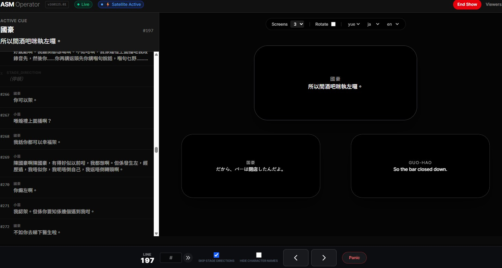

If you have ever worked in a theatre tech booth, you know the feeling.

The house lights go down. The play begins. You are sitting there in the shadows, your finger hovering over the Spacebar. You are running the theatre captioning software—or what often passes for it—for tonight’s performance.

Everything is going fine until your heart skips a beat. You hear the Stage Manager’s voice crackling in your headset: *"The actor skipped to the end of the scene! Skip to line 150!"*

**Panic.**

In front of you is a PowerPoint grid of identical-looking slides. You are locked into Slide 42, but the stage is already at Scene 4. You frantically click forward, flashing Slides 43 and 44 on the giant screen above the stage, breaking the audience’s immersion and distracting the actors.

This exact moment—the **"Spacebar Panic"**—is not a human failure. It is a tool failure. We are using a tool designed for static boardroom meetings to run live, breathing, artistic performances.

Subtitles and surtitles should follow the breath of the actor, not the limitations of 90s office software. That is why we built **SurtitleLive**.

## The Slide Deck Bottleneck in Live Performance

PowerPoint and Keynote are fantastic for linear presentations. However, when we force digital surtitles and theater subtitles into a slide-based format, we encounter three major obstacles:

### 1. The Manual Formatting Bottleneck
Preparing opera subtitles (or supertitles) usually means spending hours copying lines from a Word doc, pasting them into individual slides, and manually tweaking font sizes. If the director changes a line mid-rehearsal, you are stuck editing slides one by one.

### 2. Linear Lock-in
Theatre isn't always a straight line. If an actor skips a verse or a scene, jumping back and forth is clumsy in "Presentation Mode." You often have to exit, scroll through a sea of thumbnails, and restart—all while the creative team waits.

### 3. Cluttered Accessibility
To maintain accessibility in performing arts, you might want to show multiple languages. In a slide deck, you are forced to jam both into one slide, cluttering the view, or set up expensive, complicated dual-projector systems.

---

## The SurtitleLive Solution: A Better Cockpit

We designed SurtitleLive to treat your script as **data**, not just a stack of static images. We move away from "slides" and toward a professional, live-ready workflow.

### 1. From Script to Stage in Seconds
Instead of manual formatting, SurtitleLive uses **AI-powered ingestion** to streamline your preparation. Think of our AI as your highly efficient technical intern; it’s not here to create your art, but to handle the hours of "Copy-Paste" work that every tech designer hates.

You upload your script, and our engine instantly analyzes the structure to identify character names and dialogue. What used to take a full afternoon now takes minutes.

  

### 2. Reliable Non-Linear Navigation
Because theatre is unpredictable, our interface—the **SurtitleLive Cockpit**—is built for precision. We don't use a linear clicker logic.

*   **Jump to Any Line**: If an actor skips a paragraph, you simply click the exact line they moved to in your script data. The audience sees the jump instantly, without the distracting "flash" of skipped slides.
*   **Dark Mode Native**: A UI designed specifically for the dark booth, ensuring your screen doesn’t glow and distract the front-of-house.

### 3. Bring Your Own Device (BYOD) for Multilingual Audiences
Why limit subtitles to a single projector? With our cloud-based architecture, you can broadcast pre-prepared titles directly to your audience’s smartphones.

*   **Pre-verified Translations**: You can prepare multiple translation tracks in advance (assisted by AI and verified by your team).
*   **User Choice**: Audience members scan a QR code and choose their preferred language from your pre-loaded tracks.

## Evolve Your Theatre Tech Workflow

We believe that surtitling shouldn't be a chore or a source of technical anxiety. It is the crucial bridge between the performance and the audience. By embracing a dynamic, cloud-based workflow, we give designers more creative freedom and operators more peace of mind.

We built SurtitleLive because we love the theatre, and we think the people behind the booth deserve better tools. If you’ve ever run surtitles from a dark booth with a headset on, this is for you.

Ready to evolve your workflow? [Check out our Lite Tier](https://www.surtitlelive.com/pricing)—designed specifically for Fringe Festival runs—or [start for free today](https://www.surtitlelive.com/auth/register).
