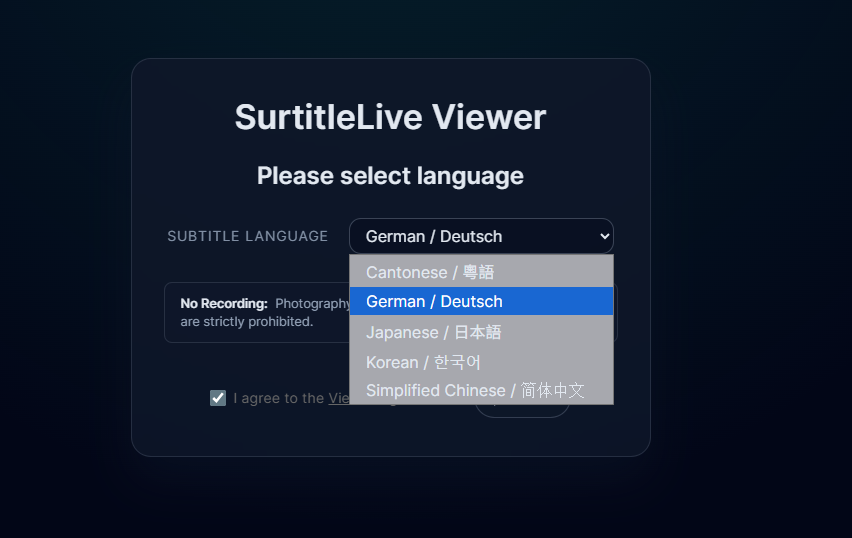
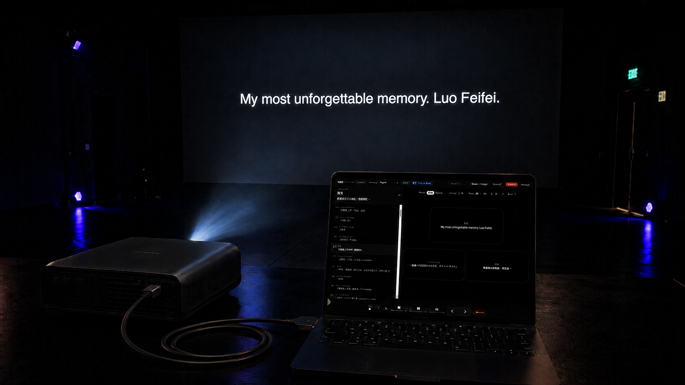

---
# DRAFT - NOT PUBLISHED. The leading underscore keeps Astro from building this
# into a page. To publish: rename to remove the `_` prefix and `-DRAFT` suffix,
# set the final pubDate, and confirm the matching GEO JSON.
title: 'Translation as Hospitality: Welcoming Fringe Audiences Without Losing the Original Voice'
description: 'A reflection for non-English Fringe companies on English surtitles, mobile language choice, and translation as hospitality: helping audiences enter the work without flattening the original voice.'
pubDate: '2026-05-23'
heroImage: './blog-10-1.png'
heroImageAlt: 'SurtitleLive being tested with projected surtitles in a black box theatre'
tags: ['Edinburgh Fringe', 'Non-English theatre', 'English surtitles', 'Multilingual audiences', 'SurtitleLive']
---

SurtitleLive began from a problem I understood as a playwright working across languages.

Not from a software category.

Not from a market gap.

From a question that kept returning whenever a story crossed from one language environment into another:

How can a performance keep the language it was born in, while giving another audience a real way to follow it?

In August 2025, I met a Ukrainian writer in Canada.

We came from different places and different languages, but we were struggling with a similar question. A story can be clear, urgent, funny, painful, and alive in one language, and still become distant the moment it meets an audience who cannot follow that language.

It was not only a technical question.

Of course there were practical problems: translation, surtitles, timing, screens, rehearsal time, and the limits of small touring teams. But underneath those production details was something more fragile.

If we translate too much, do we flatten the voice of the work?

If we translate too little, do we leave the audience outside the door?

For a non-English show going to the Edinburgh Fringe, the question is often framed in a practical way:

**How do we add English surtitles?**

But the deeper question is more human:

**How do we invite English-speaking audiences into the work without giving up the language that made the work possible?**

## The Fringe was built for stories from the edge

The Edinburgh Festival Fringe has always carried work that arrives from outside the centre. Its own history begins in 1947, when eight theatre groups came to Edinburgh without being part of the official International Festival programme and performed anyway.

That origin matters for non-English companies.

The Fringe remains an open-access festival. It is a place where artists from different countries, traditions, genres, and languages can bring work into rooms that may not already share their cultural context. A show may arrive in Edinburgh carrying a language, rhythm, and memory that local audiences do not know in advance.

That is not a weakness.

It is one of the reasons the Fringe matters.

The issue is not that the work is in another language. The issue is whether the audience has been given a clear doorway into it.

## Language is not a problem to erase

When a non-English show prepares for the Fringe, English surtitles can easily be treated as a conversion job: turn the show into English so more people can consume it.

That is the wrong starting point.

The original language is not packaging. It is part of the performance.

It carries breath, register, timing, politeness, anger, silence, playfulness, social pressure, and cultural memory. A line can be translated accurately and still arrive with a different weight. A joke can become understandable and still lose its rhythm. A phrase can become clear and still lose the relationship that made it theatrical.

English surtitles should help the audience enter the work.

They should not make the work feel as if it has abandoned its own voice.

That is the difference between translation as replacement and translation as hospitality.

Hospitality does not ask the guest to become the host. It gives the guest a way to enter the room.

For theatre, that means the audience can understand enough to stay emotionally present while the original language remains alive on stage. They hear the actors' voices. They feel the rhythm of the language. They read the English as a bridge, not as a substitute for the performance.

## English surtitles are an invitation, not a replacement

For many non-English Fringe companies, English surtitles are the first practical doorway. They help local audiences, reviewers, programmers, and visitors follow a work they might otherwise avoid because they are afraid of being lost.

But English should not always be the only doorway.

Some audience members may need the original language visible because that is how they stay close to the work's cultural texture. Some touring partners may need another prepared language. Some international guests may read a third language more comfortably than English. A co-production may want one performance to support more than one cultural route into the same piece.

If every version is forced onto one shared screen, the design quickly becomes crowded. Nobody gets the best reading experience. The English becomes shorter than it should be. The original language becomes tokenistic. Additional languages become almost impossible.

This is where per-device language choice changes the meaning of surtitling.

Instead of making one public screen carry every language, each audience member can choose the language they need on their own device. English-speaking audiences read English. Original-language audiences can choose the original text if it is provided. Invited guests or partner venues can follow another prepared language when the company supports it.

The work remains one live performance.

The routes into it multiply.

## Technology should become quiet

A humanistic position still needs a workable stage workflow.

Fringe teams do not have unlimited technical time. A venue may not have a good place for a screen. A touring company may not control the projector. A small team may have one person operating sound, lights, and surtitles. The script may still be changing close to opening.

That is why language hospitality cannot remain an abstract belief. It has to become a workflow.

| Production pressure | SurtitleLive belief |
| --- | --- |
| The venue may not support a screen. | The work should not be redesigned around one display method. |
| Different audiences may need different language routes. | One performance can support multiple ways in. |
| The show may change live. | Surtitles should follow the performance, not force playback. |

SurtitleLive is designed around that idea: prepare the text before performance, review the language choices, cue the surtitles live, and deliver them through mobile viewers, Projection Mode, or both.

A company can use projection when the room supports it, while also giving audience members a phone-based language option. The same performance can remain one shared event without forcing every audience member into the same reading route.

The point is not to make theatre more technical.

The point is to make language support easier to carry from room to room, so the company can focus on the work rather than rebuilding a subtitle system for every venue.

## Live cueing is respect for the live event

Many companies start with slides because slides are familiar. For a short, simple, linear performance, that can work.

But live performance does not always move like a presentation.

An actor pauses longer than expected. A line is cut. A cue comes early. A scene jumps. The director adjusts a section after rehearsal. Suddenly the subtitle file is not only a display document; it is the translation source, cue list, operator interface, and emergency recovery tool.

That is too much weight for a slide deck.

For non-English work, the risk is not only technical embarrassment. It is audience trust. If the surtitles fall behind, reveal too much, or disappear at the wrong moment, the audience stops feeling invited and starts feeling lost.

Prepared surtitles still need a human operator because theatre is not playback.

The operator listens, watches, advances cues, holds back when needed, and recovers when the performance breathes differently from rehearsal.

This is not a failure of automation.

It is respect for the live event.

## Audience growth follows from care

It is easy to begin with a marketing question: how can a Fringe company get a bigger audience?

That question still matters. A fuller room matters. Ticket sales matter. Discovery matters. Reviewers and programmers matter. At a festival with thousands of shows, practical visibility is not optional.

But for non-English work, audience growth should not be framed as a trick.

It is a result of care.

When you make the language route clear, more people can feel able to choose your show. When you say in the listing that English surtitles are available, people who were unsure can buy with confidence. When you let different audience members choose the language they need, you stop treating multilingual audiences as a technical inconvenience.

This is not only accessibility, though accessibility is part of it.

It is not only marketing, though marketing benefits from it.

It is language hospitality: designing the journey so more people can meet the work without asking the work to become less itself.

That is the idea behind SurtitleLive.

We want stories to move beyond the limits of language without losing the language they came from.

For a step-by-step guide to the practical setup, read [How to Add English Surtitles to a Non-English Show at the Edinburgh Fringe Festival](/blog/9-english-surtitles-non-english-show-fringe/).

[Build a workflow where translation supports the performance](https://surtitlelive.com/auth/register)

## Sources

- [History of the Fringe, Edinburgh Festival Fringe](https://www.edfringe.com/about-us/history-of-the-fringe/)
- [Getting started as an artist, Edinburgh Festival Fringe](https://www.edfringe.com/take-part/artists/organise-a-show/getting-started/)
