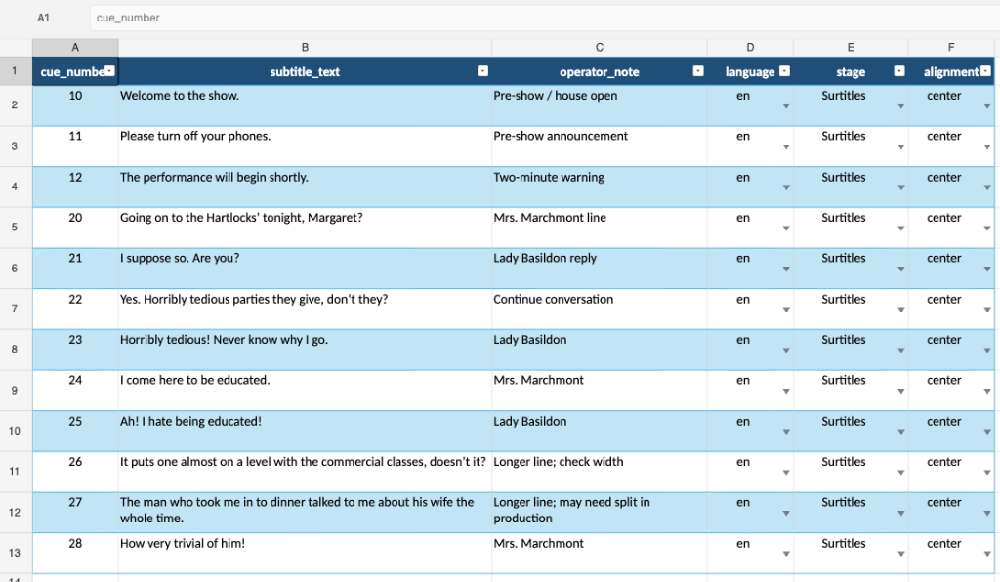
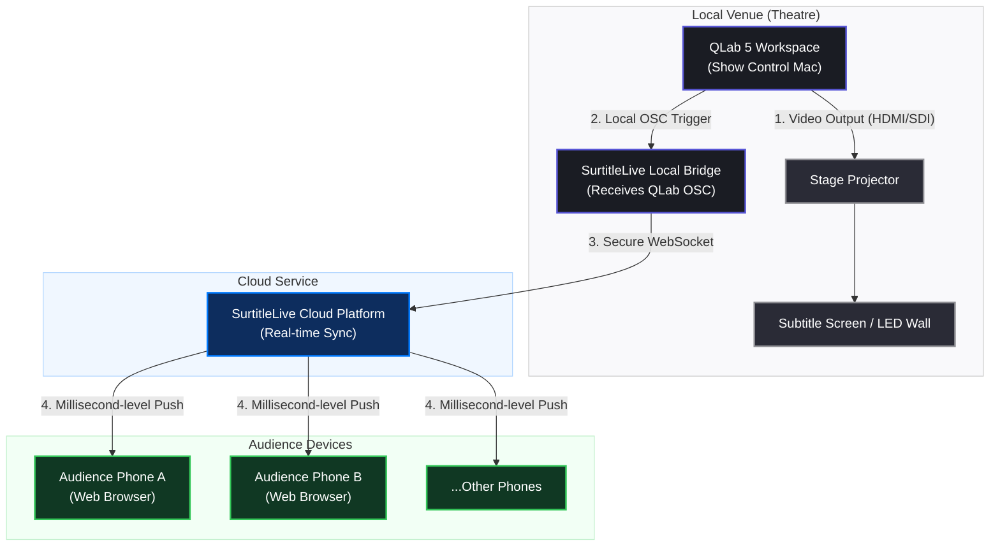

If you already run your show in QLab, the slow part is rarely the projector.

The slow part is turning a script, translation, spreadsheet, or plain text document into hundreds of cueable subtitle lines without breaking the show file.

A stage manager may have a Word script. A translator may have an Excel sheet. A technician may have a plain text list. The QLab operator needs something else: **reliable Text cues that can be placed into the show timeline, rehearsed, moved, renumbered, and triggered under pressure**.

This guide explains a fast QLab 5 workflow for building subtitles from Excel, CSV, or TXT. It also compares the method with the official QLab documentation, so the boundary is clear: what QLab supports directly, what can be automated with AppleScript, and where a dedicated surtitle workflow like SurtitleLive becomes safer.

## Can QLab display subtitles?

Yes. In QLab, subtitles or surtitles are usually built with **Text cues**.

The official QLab 5 documentation describes Text cues as cues that display styled text as video output. A Text cue can use font, size, style, alignment, color, and background color settings, and when the cue runs, QLab renders the text as video. Because Text cues are part of QLab's video system, they can be assigned to a video output stage for projection.

For theatre teams, that means a subtitle can be a normal QLab cue:

- it can sit in the same cue list as sound, video, lighting, waits, and standby moments
- it can be assigned to a projector or screen stage
- it can be formatted like other visual material
- it can be triggered with GO, a cue trigger, a timeline group, OSC, MIDI, or other show-control logic

That is the good news.

The bad news is that QLab is not a translation editor. It is not a script segmentation tool. It is not a multi-language audience viewer. If you create every subtitle by hand inside QLab, you can lose hours before rehearsal even starts.

## What the official QLab documentation supports

Before building a workflow, it is worth separating official QLab behavior from production shortcuts.

| Need | What the official QLab docs support | What this article adds |
| --- | --- | --- |
| Display projected text | QLab Text cues render styled text as video output and can be assigned to a video output stage. | Treat each subtitle as one QLab Text cue. |
| Generate many cues | The QLab AppleScript dictionary supports `make type "text"` and exposes cue properties such as `text`, `text alignment`, `fixed width`, `stage name`, `translation x`, and `translation y`. | Use a spreadsheet row or text block as the source for each Text cue. |
| Use spreadsheets | The QLab Cookbook includes a spreadsheet-driven example that reads Excel rows, creates groups, creates Text cues, sets text and formatting, and moves cues into groups. | Adapt the same pattern for subtitles and surtitles rather than flashcards. |
| Import XLSX natively as subtitles | QLab's public documentation demonstrates Excel automation, not a one-click native XLSX subtitle import feature. | Use Excel/CSV/TXT as source data, then use a script or importer to generate QLab cues. |
| Sync audience phones | QLab's Text cues handle local projection. They do not, by themselves, publish browser-based subtitle state to audience phones. | Use SurtitleLive QLab Sync when the same cue needs to drive projection and audience mobile viewing. |

This distinction matters for SEO and for production accuracy. The safe phrase is not "QLab imports Excel subtitles natively." The safer, more accurate phrase is:

**You can create QLab subtitle Text cues from Excel, CSV, or TXT using a spreadsheet-driven or script-driven workflow.**

That matches the way QLab's own Cookbook approaches spreadsheet automation.

## The fastest structure: one subtitle per row

If your source is Excel or Google Sheets, start with one subtitle per row.

Keep the sheet boring. Boring is good. Boring survives tech rehearsal.


*Download the template here: [QLab Subtitles Excel Template (XLSX)](https://surtitlelive-blog.pages.dev/blog-13-xlsx.xlsx)*

| Column | Example | Why it matters |
| --- | --- | --- |
| `cue_number` | `10` | The QLab cue number you want to assign. |
| `subtitle_text` | `Welcome to the show.` | The text the audience sees. |
| `operator_note` | `After doorbell` | A cueing note for the operator. |
| `language` | `en` | Useful if you are preparing more than one version. |
| `stage` | `Surtitles` | Optional QLab video output stage name. |
| `alignment` | `center` | Usually `center`, but keep it explicit. |

For a first pass, only two columns are essential:

```csv
cue_number,subtitle_text
10,Welcome to the show.
11,Please turn off your phones.
12,The performance will begin shortly.
```

If the subtitles are coming from a translator, ask them not to merge cells, color-code meaning, or hide production notes in comments. Put text in columns. Scripts can read columns. Operators can check columns.

## Method 1: Excel to QLab Text cues

This method is closest to the official QLab Cookbook pattern.

The idea is simple:

1. Open the subtitle spreadsheet in Excel.
2. Open the target QLab 5 workspace.
3. Set your Text cue template in QLab first.
4. Run an AppleScript that reads each row.
5. For each row, create a QLab Text cue.
6. Set the cue number, cue name, text, alignment, width, notes, and optionally the stage.
7. Move or copy the generated cues into the real show timeline.

The official Cookbook example uses Excel to create a more complex visual workspace with groups and multiple Text cues per row. For subtitles, you can simplify that pattern: **one spreadsheet row becomes one subtitle Text cue**.

A minimal AppleScript skeleton might look like this:

```applescript
tell application id "com.microsoft.Excel" to tell worksheet 1
  set theRowCount to count of rows of used range
end tell

tell application id "com.figure53.QLab.5" to tell front workspace
  -- Create a temporary import group so generated cues are easy to review
  make type "group"
  set importGroup to last item of (selected as list)
  set mode of importGroup to timeline
  set q number of importGroup to "SUBS"
  set q name of importGroup to "Generated subtitles from Excel"

  set lastTextCue to ""
  repeat with rowIndex from 2 to theRowCount
    tell application id "com.microsoft.Excel" to tell worksheet 1
      set theCueNumber to (value of cell 1 of row rowIndex) as text
      set theSubtitleText to (value of cell 2 of row rowIndex) as text
      set theOperatorNote to ""
      try
        set theOperatorNote to (value of cell 3 of row rowIndex) as text
      end try
    end tell

    -- Skip blank rows
    if theCueNumber is not "" and theSubtitleText is not "" then
      -- Create a Group cue (Timeline mode) for this subtitle step
      make type "group"
      set subGroup to last item of (selected as list)
      set mode of subGroup to timeline
      set q number of subGroup to theCueNumber
      set q name of subGroup to "Subtitle " & theCueNumber

      -- Move the group into the import container
      move subGroup to end of importGroup

      make type "text"
      set currentTextCue to last item of (selected as list)
      set q name of currentTextCue to "Text " & theCueNumber
      set text of currentTextCue to theSubtitleText
      move currentTextCue to end of subGroup

      -- If there is a previous subtitle, create a Fade cue to fade it out
      if lastTextCue is not "" then
        make type "fade"
        set theFade to last item of (selected as list)
        set q name of theFade to "Fade Out Previous"
        set cue target of theFade to lastTextCue
        set duration of theFade to 0.05
        set stop target when done of theFade to true
        set do opacity of theFade to true
        set opacity of theFade to 0
        move theFade to end of subGroup
        
        -- Current text cue waits 0.05s for the previous one to fade out
        set pre wait of currentTextCue to 0.05
      end if

      -- Apply layout settings to the Text cue
      set theCue to currentTextCue
      set text alignment of theCue to "center"
      set fixed width of theCue to 1600
      set notes of theCue to theOperatorNote

      set lastTextCue to currentTextCue
    end if
  end repeat
end tell
```

*You can download the complete companion package containing this AppleScript, the Excel template, and screenshot here: [QLab Subtitles Demo Assets (ZIP)](https://surtitlelive-blog.pages.dev/blog-13-qlab-subtitles-demo-assets.zip).*

This is not a finished production importer. It is a readable starting point.

For a real show, add checks before writing into the QLab workspace:

- stop if a cue number is blank
- stop if a cue number already exists
- trim extra spaces from subtitle text
- warn if a line is too long
- reject rows marked as draft or not approved
- put generated cues into a temporary group first
- keep a timestamped backup of the QLab workspace

The safest workflow is to generate cues into a separate QLab workspace or a clearly named group, review them, and only then paste them into the live show file.

## Method 2: CSV to QLab subtitles

CSV is often a better interchange format than XLSX.

Excel is convenient for editing. CSV is convenient for automation.

A CSV workflow usually looks like this:

1. Edit subtitles in Excel, Google Sheets, Numbers, or Airtable.
2. Export as CSV.
3. Run a small importer that reads the CSV and creates QLab Text cues.
4. Review the generated QLab cues before rehearsal.

The advantage is that the importer does not need to talk directly to Excel. It can read a plain CSV file. That makes the workflow easier to version, test, and repeat.

A CSV can also live in Git, so changes are easier to review. For example, a production manager can see that cue 42 changed from one translation to another without opening the QLab workspace.

For theatre teams, this is useful because subtitle work keeps changing:

- a translation is shortened
- an actor changes a pause
- a joke needs a different line break
- a late cut removes a page
- the director asks to move a subtitle two cues earlier

If your source data is structured, rebuilding the QLab cue list becomes repeatable instead of manual.

## Method 3: TXT to QLab subtitles

Plain text is the fastest starting point when you do not yet have a spreadsheet.

Use a simple block format:

```txt
10
Welcome to the show.

11
Please turn off your phones.

12
The performance will begin shortly.
```

In this format, each subtitle block has:

1. a cue number
2. one or more lines of subtitle text
3. a blank line before the next block

A TXT importer can split the file on blank lines, read the first line as the QLab cue number, and treat the remaining lines as the subtitle text.

This is fast, but it is also fragile. Plain text is fine for a small event or a scratch rehearsal. It becomes weak when you need multiple languages, approval status, operator notes, scene numbers, speaker names, or revision history.

For serious surtitles, convert TXT into a spreadsheet or a dedicated surtitle editor as soon as the structure becomes more complex.

## Projection setup: do not forget the stage

Generating Text cues is only half the job.

A QLab Text cue must output somewhere. In the official QLab Text cue inspector, the I/O tab assigns the cue to a video output stage. If the cue has no stage, the Text cue can be broken or fail to appear where expected.


Before importing hundreds of subtitle cues, create and test the stage:

- connect the projector or display
- configure the QLab video output stage
- make one manual Text cue
- set the font, size, color, width, alignment, and position
- confirm it is readable from the back row
- save that cue as the template or copy its settings into the generated cues

Do this before automation. Automation repeats your setup. If the template is wrong, automation repeats the wrong setup very quickly.

## What usually breaks in DIY QLab subtitle workflows

DIY QLab subtitle generation works well when the problem is simple:

**I have text. I need QLab Text cues.**

It becomes harder when the problem is actually this:

**I have a translated script, late edits, multiple versions, a projection screen, audience phones, cue jumps, and a live operator who needs to recover when the show goes off script.**

Common failure points include:

- duplicated cue numbers
- missing stage assignment
- subtitles that are too wide for the screen
- line breaks that looked fine in Excel but not on the projector
- translation changes after cues have already been imported
- QLab show files that become the only place where subtitle text exists
- no clean way to compare version 3 and version 4 of the translation
- projection and mobile subtitle delivery drifting apart
- operator stress when actors skip, repeat, or reorder lines

That is the boundary between "quick QLab automation" and a real surtitle production workflow.

## When SurtitleLive is the better workflow

If you only need local projection, a QLab Text cue workflow may be enough.

If you need translation review, stable cue keys, mobile viewing, or projection plus audience phones, SurtitleLive gives the subtitle work a dedicated home before it reaches QLab.

The SurtitleLive QLab workflow has two levels.

### QLab Projection Pack

Use this when you want local projection from QLab.

The workflow is:

**SurtitleLive Editor → QLab Projection Pack → QLab Text cues → projector**

You prepare the script and subtitle segments in SurtitleLive, review translations and cue order, then export QLab-ready cues. QLab remains the playback environment for the venue.

This is useful when QLab is already the technical operator's centre of gravity, but the subtitle preparation should not happen inside QLab one cue at a time.

### QLab + SurtitleLive Cloud Sync

Use this when QLab should keep running the show timeline, but audience phones should follow the same subtitle state.

The workflow is:

**QLab → local projection → projector**

and, at the same cue point:

**QLab sync cue → local Mac bridge → SurtitleLive Cloud → audience phones**

In this setup, each SurtitleLive subtitle can import into QLab as a timeline Group. The Group contains a Text cue for local projection and a sync cue for audience phones. The operator still works inside the QLab timeline, while SurtitleLive handles the audience mobile subtitle state.



This matters because a phone subtitle workflow should not require audience devices to talk directly to QLab. The show computer, the projector, the local bridge, and the audience link all have different jobs.

## Best practical recommendation

For a small one-night event:

**Use Excel or TXT to generate QLab Text cues. Keep it simple. Test the projector. Save a backup.**

For a translated theatre show:

**Prepare subtitles outside QLab, then import into QLab after the text is reviewed.**

For a multi-language or mobile-viewer show:

**Use SurtitleLive with QLab export or QLab Sync. Keep QLab as the show timeline, but do not make QLab the only source of truth for subtitle content.**

The goal is not to replace QLab. The goal is to let QLab do what QLab is excellent at: live show control.

Subtitle preparation, translation review, mobile viewing, and cue-state synchronization need their own workflow.

## FAQ

### Can QLab show subtitles?

Yes. QLab Text cues can display styled text as video output, so they are commonly used for projected subtitles, surtitles, captions, announcements, and similar text-based visuals.

### Can I import Excel subtitles directly into QLab?

QLab's official Cookbook demonstrates Excel-driven cue generation using AppleScript, but that is different from a built-in one-click XLSX subtitle import feature. The practical approach is to use Excel as source data, then run a script or importer that creates QLab Text cues.

### Can I make QLab subtitles from CSV?

Yes, with an importer. CSV is often easier than XLSX because it is plain text and easier to parse. A script can read each row and create one Text cue per subtitle.

### Can I make QLab subtitles from TXT?

Yes, if the TXT file uses a predictable structure. For example, each block can start with a cue number, followed by the subtitle text, with blank lines between cues. A script can convert those blocks into QLab Text cues.

### Should subtitles be QLab Text cues or Video cues?

For editable live text, use Text cues. Video cues are better when the subtitle is already baked into a rendered video or graphic. Text cues are easier to revise, format, and generate from structured text.

### Does QLab sync subtitles to audience phones?

QLab can project Text cues locally, but audience phone delivery needs a browser/mobile workflow. SurtitleLive QLab Sync is designed for that: QLab remains the show timeline while SurtitleLive updates the audience phone subtitle state.

### When should I stop using DIY QLab subtitle scripts?

Stop relying only on DIY scripts when the subtitle workflow needs translation review, multiple languages, stable cue keys, mobile viewing, rehearsal recovery, or repeated updates after import. At that point, use a dedicated surtitle workflow and export into QLab instead of maintaining all subtitle content manually inside the QLab workspace.

## Related resources

- QLab 5 Text Cues: https://qlab.app/docs/v5/video/text-cues/
- QLab 5 AppleScript Dictionary: https://qlab.app/docs/v5/scripting/applescript-dictionary-v5/
- QLab Cookbook — Grid: https://qlab.app/cookbook/grid/
- SurtitleLive QLab workflow: https://surtitlelive.com/qlab
- SurtitleLive Exporting a QLab Import Pack: https://surtitlelive.com/guides/export-qlab-import-pack
- SurtitleLive QLab control for ASM and Viewer sync User guides: https://surtitlelive.com/guides/qlab-asm-viewer-sync-beta
