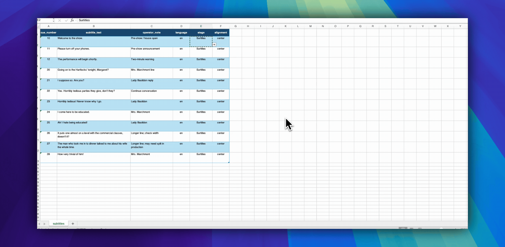
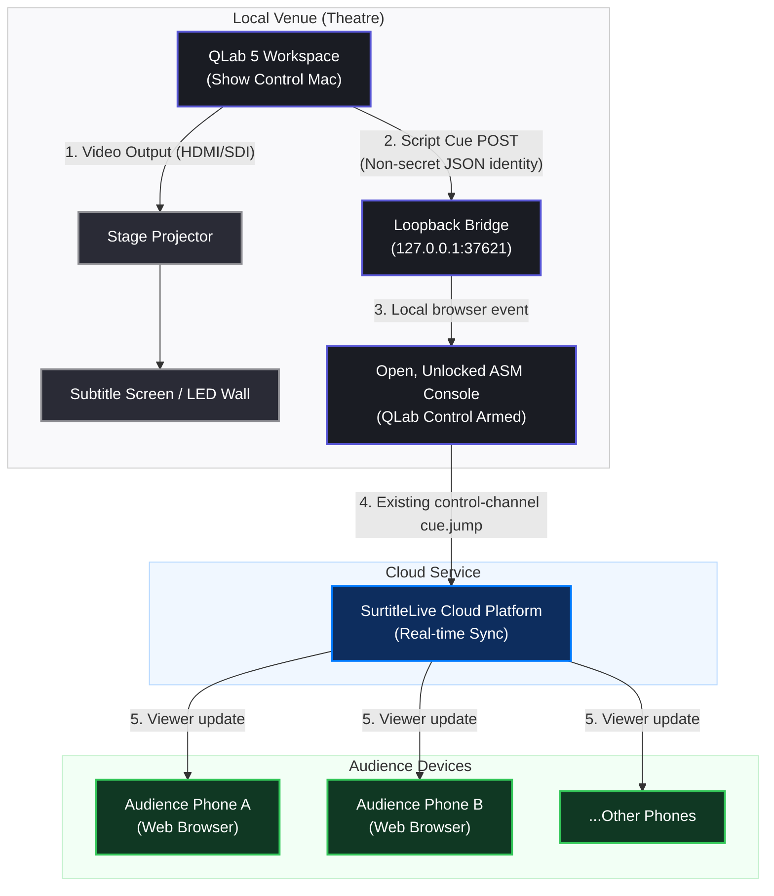

If you already run your show in QLab, the slow part is rarely the projector.

The slow part is turning a script, translation, spreadsheet, or plain text document into hundreds of cueable subtitle lines without breaking the show file.

A stage manager may have a Word script. A translator may have an Excel sheet. A technician may have a plain text list. The QLab operator needs something else: **reliable Text cues that can be placed into the show timeline, rehearsed, moved, renumbered, and triggered under pressure**.

This guide explains a fast QLab 5 workflow for building subtitles from Excel, CSV, or TXT. It also compares the method with the official QLab documentation, so the boundary is clear: what QLab supports directly, what can be automated with AppleScript, and when a reviewed QLab Projection Pack is safer than making a show file the only home of the text.

## Can QLab display subtitles?

Yes. In QLab, subtitles or surtitles are usually built with **Text cues**.

The official QLab 5 documentation describes Text cues as cues that display styled text as video output. A Text cue can use font, size, style, alignment, color, and background color settings, and when the cue runs, QLab renders the text as video. Because Text cues are part of QLab's video system, they can be assigned to a video output stage for projection.

For theatre teams, that means a subtitle can be a normal QLab cue:

- it can sit in the same cue list as sound, video, lighting, waits, and standby moments
- it can be assigned to a projector or screen stage
- it can be formatted like other visual material
- it can be triggered with GO, a cue trigger, a timeline group, OSC, MIDI, or other show-control logic

That is the good news.

The bad news is that QLab is not a translation editor. It is not a script segmentation tool. It is not a multi-language audience viewer. If you create every subtitle by hand inside QLab, you can lose hours before rehearsal even starts.

## What the official QLab documentation supports

Before building a workflow, it is worth separating official QLab behavior from production shortcuts.

| Need | What the official QLab docs support | What this article adds |
| --- | --- | --- |
| Display projected text | QLab Text cues render styled text as video output and can be assigned to a video output stage. | Treat each subtitle as one QLab Text cue. |
| Generate many cues | The QLab AppleScript dictionary supports `make type "text"` and exposes cue properties such as `text`, `text alignment`, `fixed width`, `stage name`, `translation x`, and `translation y`. | Use a spreadsheet row or text block as the source for each Text cue. |
| Use spreadsheets | The QLab Cookbook includes a spreadsheet-driven example that reads Excel rows, creates groups, creates Text cues, sets text and formatting, and moves cues into groups. | Adapt the same pattern for subtitles and surtitles rather than flashcards. |
| Import XLSX natively as subtitles | QLab's public documentation demonstrates Excel automation, not a one-click native XLSX subtitle import feature. | Use Excel/CSV/TXT as source data, then use a script or importer to generate QLab cues. |
| Sync audience phones | QLab's Text cues handle local projection. They do not, by themselves, publish browser-based subtitle state to audience phones. | A finalized-show SurtitleLive QLab Projection Pack can add one local Script child per source cue; the operator must explicitly connect and arm the normal ASM console before it can publish Viewer state. |

This distinction matters for SEO and for production accuracy. The safe phrase is not "QLab imports Excel subtitles natively." The safer, more accurate phrase is:

**You can create QLab subtitle Text cues from Excel, CSV, or TXT using a spreadsheet-driven or script-driven workflow.**

That matches the way QLab's own Cookbook approaches spreadsheet automation.

## The fastest structure: one subtitle per row

If your source is Excel or Google Sheets, start with one subtitle per row.

Keep the sheet boring. Boring is good. Boring survives tech rehearsal.


*You can download the complete companion package containing this AppleScript, the Excel template, and screenshot here: [QLab Subtitles Demo Assets (ZIP)](https://surtitlelive-blog.pages.dev/blog-13-qlab-subtitles-demo-assets.zip).*

| Column | Example | Why it matters |
| --- | --- | --- |
| `cue_number` | `10` | The QLab cue number you want to assign. |
| `subtitle_text` | `Welcome to the show.` | The text the audience sees. |
| `operator_note` | `After doorbell` | A cueing note for the operator. |
| `language` | `en` | Useful if you are preparing more than one version. |
| `stage` | *(blank)* | Leave blank to use QLab's default stage. A named stage is optional. |
| `alignment` | `center` | Usually `center`, but keep it explicit. |

For a first pass, only two columns are essential:

```csv
cue_number,subtitle_text
10,Welcome to the show.
11,Please turn off your phones.
12,The performance will begin shortly.
```

If the subtitles are coming from a translator, ask them not to merge cells, color-code meaning, or hide production notes in comments. Put text in columns. Scripts can read columns. Operators can check columns.

## Method 1: Excel to QLab Text cues

This method is closest to the official QLab Cookbook pattern.

The idea is simple:

1. Open the subtitle spreadsheet in Excel.
2. Open the target QLab 5 workspace.
3. Create and project one manual Text cue to confirm the Video License, stage, output route, and projector all work.
4. Run an AppleScript that reads each row.
5. For each row, create a top-level Timeline Group containing the subtitle Text cue and, from the second subtitle onward, a Fade cue that clears the previous line.
6. Set the operator-facing cue number and name, subtitle text, alignment, width, notes, and optionally the stage.
7. Review the generated top-level Groups in the active QLab cue list before using them in the show.

The official Cookbook example uses Excel to create a more complex visual workspace with groups and multiple Text cues per row. For subtitles, you can simplify that pattern: **one spreadsheet row becomes one subtitle Text cue**.

A minimal AppleScript skeleton might look like this:

```applescript
-- Official QLab 5 pattern:
-- https://qlab.app/docs/v5/scripting/examples/#create-and-move-a-new-cue
on makeCueInGroup(cueType, destinationContainer)
  tell application id "com.figure53.QLab.5" to tell front workspace
    make type cueType
    set newCue to last item of (selected as list)
    set q number of newCue to ""
    set newCueID to uniqueID of newCue
    set sourceList to parent of newCue
    move cue id newCueID of sourceList to end of destinationContainer
    return cue id newCueID of destinationContainer
  end tell
end makeCueInGroup
```

The complete companion script keeps the QLab cue list readable during a show:

- Every subtitle is a top-level Timeline Group in the active cue list. There is no extra import Group around the show cues.
- Sound, Light, Video, Wait, and other show cues can therefore be inserted between any two subtitle steps.
- Excel's `cue_number` becomes the QLab **Number**.
- Excel's `subtitle_text` becomes the visible QLab **Name** of the operator-facing Timeline Group.
- The operator therefore sees `20 | Going on to the Hartlocks’ tonight, Margaret?`, not only `20 | Subtitle 20`.
- From the second subtitle onward, each Timeline Group contains `CLEAR PREVIOUS` followed by `DISPLAY en`. The new Text cue has a 0.05-second pre-wait, so the old line is faded and stopped before the new line appears.
- The first subtitle contains only `DISPLAY en` because there is no previous subtitle to clear.
- A final top-level `CLEAR LAST SUBTITLE` step removes the final line at the end of the subtitle sequence.


This is not a finished production importer. It is a readable starting point.

For a real show, add checks before writing into the QLab workspace:

- stop if a cue number is blank
- stop if a cue number already exists
- trim extra spaces from subtitle text
- warn if a line is too long
- reject rows marked as draft or not approved
- generate into a disposable copy of the QLab workspace first
- keep a timestamped backup of the QLab workspace

The safest workflow is to generate cues into a disposable copy of the QLab workspace, review the resulting top-level Groups, and only then repeat the import in the real show workspace or transfer the reviewed cues according to your show's change-control process.

## Method 2: CSV to QLab subtitles

CSV is often a better interchange format than XLSX.

Excel is convenient for editing. CSV is convenient for automation.

A CSV workflow usually looks like this:

1. Edit subtitles in Excel, Google Sheets, Numbers, or Airtable.
2. Export as CSV.
3. Run a small importer that reads the CSV and creates QLab Text cues.
4. Review the generated QLab cues before rehearsal.

The advantage is that the importer does not need to talk directly to Excel. It can read a plain CSV file. That makes the workflow easier to version, test, and repeat.

A CSV can also live in Git, so changes are easier to review. For example, a production manager can see that cue 42 changed from one translation to another without opening the QLab workspace.

For theatre teams, this is useful because subtitle work keeps changing:

- a translation is shortened
- an actor changes a pause
- a joke needs a different line break
- a late cut removes a page
- the director asks to move a subtitle two cues earlier

If your source data is structured, rebuilding the QLab cue list becomes repeatable instead of manual.

## Method 3: TXT to QLab subtitles

Plain text is the fastest starting point when you do not yet have a spreadsheet.

Use a simple block format:

```txt
10
Welcome to the show.

11
Please turn off your phones.

12
The performance will begin shortly.
```

In this format, each subtitle block has:

1. a cue number
2. one or more lines of subtitle text
3. a blank line before the next block

A TXT importer can split the file on blank lines, read the first line as the QLab cue number, and treat the remaining lines as the subtitle text.

This is fast, but it is also fragile. Plain text is fine for a small event or a scratch rehearsal. It becomes weak when you need multiple languages, approval status, operator notes, scene numbers, speaker names, or revision history.

For serious surtitles, convert TXT into a spreadsheet or a dedicated surtitle editor as soon as the structure becomes more complex.

## Projection setup: do not forget the stage

Generating Text cues is only half the job. QLab also needs a working path from the Text cue to a stage, from the stage to an output route, and from that route to a physical display or projector.

QLab's official documentation states that a **Video License is required to use Text cues**. This guide therefore assumes that QLab has an active Video License or a Bundle License that includes Video. Without it, the importer can create Text cues, but QLab marks them as broken and they cannot project. See QLab's official [Text Cues documentation](https://qlab.app/docs/v5/video/text-cues/) and [license feature table](https://qlab.app/docs/v5/general/features/).

Before continuing, open **QLab → Manage Your Licenses** and confirm that Video is licensed. An Audio-only license is not sufficient for Text cues.

### Beginner setup: connect one projector

Do this before running the Excel importer:

1. Connect the projector or external display to the Mac and turn it on.
2. Open macOS **System Settings → Displays** and confirm the projector appears. For normal surtitles, use it as an extended display rather than mirroring the operator screen.
3. Open QLab. If possible, create a new workspace after the projector is connected. QLab normally creates a stage for each connected display when it creates the workspace.
4. Open **Workspace Settings → Video**.
5. In **Video Outputs**, find the stage for the projector. Confirm that the **Devices** column names the projector or external display. A stage with no device cannot project the subtitles.
6. If no suitable stage exists, open **Output Routing**, create an output route using the projector as its device, return to **Video Outputs**, then choose **New Video Stage → Stage with output** and select that route.
7. Give the stage a simple name such as `Surtitles`. Avoid changing its name after importing if the Excel sheet refers to it by name.

QLab's terms describe a signal path:

**Text cue → Stage → Region → Output Route → Projector**

If any link is missing, QLab can create the cue but mark it as broken or show nothing on the projector.

### Test one Text cue before importing Excel

1. Create one Text cue manually in QLab.
2. Enter a short test line such as `Subtitle test`.
3. In the Text cue's **I/O** inspector, select the projector stage.
4. Run the cue.
5. Confirm the text appears on the projector, not only in QLab's preview or stage monitor.
6. Adjust font, size, color, width, alignment, and position until it is readable from the back row.

Only run the Excel importer after this manual Text cue works.

### What to put in Excel's `stage` column

- Leave `stage` blank for the easiest workflow. The script keeps QLab's default stage for each new Text cue.
- Enter a stage name only when you intentionally created that stage and the spelling matches QLab exactly.
- If the spreadsheet contains a stage name that QLab cannot find, the companion script keeps the default stage and records the fallback in the cue notes.



### If the importer runs but the subtitles do not project

| What you see | What it means | What to do |
| --- | --- | --- |
| QLab shows `QLab Video License or output required` | The subtitle cues were created, but at least one Text cue is broken. | First confirm a Video or Bundle License is active. Then configure **Workspace Settings → Video** and test the cues already created. Do not import them again. |
| Every generated Text cue is broken and no Video stages are available | QLab does not have an active Video License. | Install or activate a Video or Bundle License. Text cues cannot project without it. |
| A Text cue has a red error mark or reports `broken` | Its stage, route, or output device is unavailable. | Check the Text cue's I/O stage, then check the stage's region, route, and device. |
| The cue runs but nothing reaches the projector | QLab is probably using the wrong stage or the route points to the wrong display. | Select the intended stage in the Text cue and verify the route's device. |
| The script reports that cue number `10` already exists | A previous import or another show cue already uses that number. | Use a new/copy workspace or remove the earlier test import after confirming it is safe. |
| QLab contains generated subtitle groups but running the script again fails | The first import already succeeded structurally. | Fix the video output and use the existing cues instead of importing duplicates. |

Automation repeats your setup. If the output path or Text cue styling is wrong, automation repeats that mistake very quickly.

## What usually breaks in DIY QLab subtitle workflows

DIY QLab subtitle generation works well when the problem is simple:

**I have text. I need QLab Text cues.**

It becomes harder when the problem is actually this:

**I have a translated script, late edits, multiple versions, a projection screen, audience phones, cue jumps, and a live operator who needs to recover when the show goes off script.**

Common failure points include:

- duplicated cue numbers
- missing stage assignment
- subtitles that are too wide for the screen
- line breaks that looked fine in Excel but not on the projector
- translation changes after cues have already been imported
- QLab show files that become the only place where subtitle text exists
- no clean way to compare version 3 and version 4 of the translation
- projection and mobile subtitle delivery drifting apart
- operator stress when actors skip, repeat, or reorder lines

That is the boundary between "quick QLab automation" and a real surtitle production workflow.

## When SurtitleLive is the better workflow

If you only need local projection, a QLab Text cue workflow may be enough.

If you need translation review, stable cue keys, mobile viewing, or projection plus audience phones, SurtitleLive gives the subtitle work a dedicated home before it reaches QLab.

The SurtitleLive QLab workflow has two levels.

### QLab Projection Pack

Use this when you want local projection from QLab.

The workflow is:

**SurtitleLive Editor → QLab Projection Pack → QLab Text cues → projector**

You prepare the script and subtitle segments in SurtitleLive, review translations and cue order, then export QLab-ready cues. QLab remains the playback environment for the venue.

This is useful when QLab is already the technical operator's centre of gravity, but the subtitle preparation should not happen inside QLab one cue at a time.

The downloaded pack keeps data and executable instructions separate. Its `1 - START HERE.txt` explains the operator path, `2a - Import into QLab.applescript` is the static importer, and `2b - QLab Cue Data.json` contains the prepared cue data. The Editor-origin pack is an offline projection handoff: it does not create a deployment, open ASM, or publish to Viewer.

Each source subtitle keeps a stable SurtitleLive cue key. A revised import can therefore update matching SurtitleLive caption Groups in place, insert newly added source cues, and mark captions removed from SurtitleLive for operator review. It does not silently delete those old Groups or overwrite unrelated sound, light, video, standby, or stage-management cues.

The export options also define the intended projection outputs. One source cue can contain several Text children for different languages or screens while remaining one operator cue moment. Languages sharing a screen need different caption positions; outputs sent to separate projectors need distinct QLab stage names. Test the resulting stage assignments in the actual venue.

### Finalized-show QLab and Viewer sync

Use this when QLab should keep running the show timeline, but the already-deployed SurtitleLive Viewer should follow the same source cue.

The workflow is:

**QLab → local projection → projector**

and, at the same cue point:

**QLab Script child → loopback bridge → open ASM console → existing control channel → Viewer**

For a finalized show, the Deployment Cockpit QLab Projection Pack can import each source subtitle as one timeline Group. A Group may contain one or more Text children for the selected languages or projector outputs, but it has at most one local Script child. All of those children remain under the same stable SurtitleLive cue key.

The Script child sends a non-secret JSON cue identity to a bridge bound to `127.0.0.1:37621`. The bridge does **not** call SurtitleLive's backend or carry an ASM password, Viewer link, runtime token, or cloud credential. It relays the local cue event to the already-open ASM console; ASM remains responsible for publishing the existing `cue.jump` state through the control channel.

This path is intentionally operator-armed:

1. Enable QLab for the finalized show in Deployment Cockpit and download a fresh QLab Projection Pack.
2. Import the pack into QLab, then double-click `3 - Start Local Bridge.command` and keep its Terminal window open.
3. Open and unlock the normal ASM console.
4. Click **QLab enabled**, then **Connect local bridge**.
5. Wait until Viewer sync is ready, start the show with the normal explicit **Go Live** action, and only then choose **Allow QLab control**.

Connecting the bridge never starts a show automatically. If the local bridge is unavailable, disconnect QLab control and return to the normal manual ASM controls.



This matters because audience devices should not talk directly to QLab, and the loopback bridge should not become a second cloud-control path. QLab runs the local timeline, the bridge carries a bounded cue identity on the show Mac, ASM applies the operator's armed control state, and the existing SurtitleLive control channel updates Viewer.

## Best practical recommendation

For a small one-night event:

**Use Excel or TXT to generate QLab Text cues. Keep it simple. Test the projector. Save a backup.**

For a translated theatre show:

**Prepare subtitles outside QLab, then import into QLab after the text is reviewed.**

For a multi-language or mobile-viewer show:

**Use a SurtitleLive QLab Projection Pack. Add the finalized-show ASM sync path only when Viewer must follow QLab, and arm it deliberately before the performance.**

The goal is not to replace QLab. The goal is to let QLab do what QLab is excellent at: live show control.

Subtitle preparation, translation review, mobile viewing, and cue-state synchronization need their own workflow.

## FAQ

### Can QLab show subtitles?

Yes. QLab Text cues can display styled text as video output, so they are commonly used for projected subtitles, surtitles, captions, announcements, and similar text-based visuals.

### Can I import Excel subtitles directly into QLab?

QLab's official Cookbook demonstrates Excel-driven cue generation using AppleScript, but that is different from a built-in one-click XLSX subtitle import feature. The practical approach is to use Excel as source data, then run a script or importer that creates QLab Text cues.

### Can I make QLab subtitles from CSV?

Yes, with an importer. CSV is often easier than XLSX because it is plain text and easier to parse. A script can read each row and create one Text cue per subtitle.

### Can I make QLab subtitles from TXT?

Yes, if the TXT file uses a predictable structure. For example, each block can start with a cue number, followed by the subtitle text, with blank lines between cues. A script can convert those blocks into QLab Text cues.

### Should subtitles be QLab Text cues or Video cues?

For editable live text, use Text cues. Video cues are better when the subtitle is already baked into a rendered video or graphic. Text cues are easier to revise, format, and generate from structured text.

### Does QLab sync subtitles to audience phones?

QLab can project Text cues locally, but audience phone delivery needs a browser/mobile workflow. A finalized-show SurtitleLive QLab Projection Pack can include local Script children that identify the same source cues to an explicitly connected and armed ASM console. The bridge stays on the show Mac; ASM, not QLab or the bridge, publishes Viewer state through the existing control channel.

### When should I stop using DIY QLab subtitle scripts?

Stop relying only on DIY scripts when the subtitle workflow needs translation review, multiple languages, stable cue keys, mobile viewing, rehearsal recovery, or repeated updates after import. At that point, use a dedicated surtitle workflow and export into QLab instead of maintaining all subtitle content manually inside the QLab workspace.

## Related resources

- QLab 5 Text Cues: https://qlab.app/docs/v5/video/text-cues/
- QLab 5 AppleScript Dictionary: https://qlab.app/docs/v5/scripting/applescript-dictionary-v5/
- QLab Cookbook — Grid: https://qlab.app/cookbook/grid/
- SurtitleLive QLab workflow: https://surtitlelive.com/qlab
- SurtitleLive Exporting a QLab Import Pack: https://surtitlelive.com/guides/export-qlab-import-pack
- SurtitleLive QLab control for ASM and Viewer sync User guides: https://surtitlelive.com/guides/qlab-asm-viewer-sync-beta
