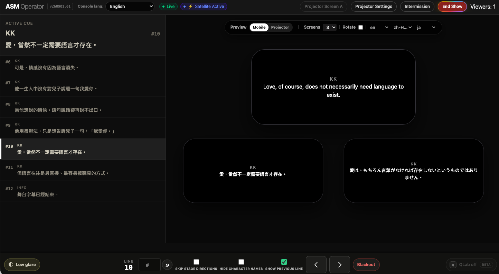

**Short answer:** if a performance has a stable script, surtitles are usually best controlled by a person who knows the show. AI can help prepare scripts, translations and subtitle cues, and automatic following can reduce repetitive work. But theatre is live. Performers skip, repeat, pause, recover, improvise and respond to an audience. A human operator can decide what the audience should see *now*, not only what the next line is supposed to be.

Timing also carries dramatic meaning. A perfectly translated line can still damage a scene if it appears two seconds too early and reveals a secret, a character identity, a confession or a punchline before the performer does. For scripted theatre, keeping a responsible human at the final cueing layer is often less about resisting automation and more about protecting the performance.

## A surtitle operator is not just the person pressing “next”

If a cue list always advanced in exactly the same order, operating surtitles would look simple:

```text
Cue 1
↓
Cue 2
↓
Cue 3
↓
Cue 4
```

Real performances are rarely that tidy.

A performer may:

- skip a line;
- repeat the previous line;
- enter the next section early;
- forget text and recover from a different point;
- wait for laughter or applause;
- stretch a pause far beyond rehearsal timing;
- cut a short section on the night;
- stop because of a technical problem;
- change the rhythm because the scene feels different with a live audience.

The operator is therefore not simply advancing slides. They are continuously deciding:

1. Where is the performance now?
2. What is the audience currently reading?
3. Is the next prepared cue still the correct cue?
4. If the performers have jumped ahead, where should the text recover?
5. Should the display go blank rather than show the wrong line?
6. Does a line need to wait until the performer actually says it?

Cueing is part of the live performance system.

## Theatre becomes difficult for automation when the show leaves the expected path

Automatic script-following works best when speech stays close to the prepared text and progresses in a predictable order.

Imagine a script contains:

```text
A: You finally came.

B: I thought you would not wait for me.

A: I waited for three years.
```

One night, B misses the second line and the scene jumps directly to:

> I waited for three years.

A human operator who knows the show can often recognise the jump immediately.

An automatic system may still be waiting for the missing sentence, may temporarily match later speech to the wrong part of the script, or may need a few seconds to regain confidence about where the performance has moved.

Two or three seconds may be insignificant in a software benchmark. For an audience member trying to read while watching the stage, it can be enough to break the connection between text and performance.

That is why a useful theatre-captioning question is not only:

> How accurately can the system recognise speech?

It is also:

> **How does the system recover when the performance does something unexpected?**

## Some surtitles cannot appear even one second early

Some of the hardest cueing decisions are not mistakes at all. They are part of the dramaturgy.

Imagine a suspense scene:

```text
A: You really did not see him that night?

B: No.

(Pause.)

B: The truth is… I was the one who locked the door.
```

The final line changes the scene.

The actor may hold the silence for five seconds in one performance and only two seconds in another. That silence is not empty time. The audience may be deciding whether to believe B, noticing another character’s reaction, or waiting for the next piece of information.

If a subtitle system displays the confession while the actor is still silent, the subtitle has already revealed the truth.

The translation can be flawless. The spelling can be flawless. The cue can be the correct line from the script.

But it arrived at the wrong time.

In theatre, that is still wrong.

## A subtitle can be word-perfect and still spoil the scene

The same problem appears with:

- the reveal of a character’s true identity;
- a death announcement;
- the contents of a letter or will;
- a romantic confession;
- the final word of a joke;
- a name that should not be known yet;
- a line that only makes sense after a lighting change;
- text that should land after music stops;
- a deliberate silence that the audience needs to experience first.

**Surtitles can be textually correct and still damage a performance.** Dramatic timing is part of subtitle accuracy.

## Human operator, AI auto-follow or live captioning?

These approaches can all put text in front of an audience, but they solve different production problems.

| Approach | Strengths | Main limitation | Best fit |
| --- | --- | --- | --- |
| **Dedicated surtitle operator** | Understands context; can wait, jump cues, recover, blank the display and protect reveals or comic timing | Requires a person to rehearse and operate the show | Scripted theatre, opera, musical theatre and work where timing matters |
| **AI / automatic script following** | Can reduce repetitive manual cueing when speech closely follows a prepared script | Can lose position on skips, repeats, long pauses, overlap or deviations; does not necessarily understand dramatic reveal timing | Highly stable performances with predictable speech and strong rehearsal evidence |
| **Live captioning / speech-to-text** | Does not require the exact wording to exist in advance | Text and translation cannot be fully reviewed before delivery; recognition and latency can vary | Improvisation, talks, post-show discussions, Q&A and other unscripted speech |

The most useful question is therefore not “Is AI better than a person?”

Ask instead:

> **Do we know what will be said before the performance starts?**

If the words already exist, the team can translate, edit, segment, approve and rehearse them before the audience arrives. In that situation, it is often sensible to keep a person responsible for the final live timing.

If the words do not exist until someone speaks them, live captioning solves a different problem.

## AI is often strongest before the curtain goes up

AI can still be valuable in a prepared surtitling workflow.

Depending on the production and the tools being used, it may help with:

- analysing script structure;
- identifying speakers and dialogue;
- producing a first translation draft;
- restructuring or shortening text;
- reviewing repetitive language work;
- reducing preparation time.

These tasks share an important advantage: **there is still time for a person to check the result.**

A weak translation can be edited. A speaker can be corrected. A cue that is too long can be split. A term that does not fit the production’s voice can be replaced.

Live cueing is different.

When performers suddenly skip five lines, the question may become, within seconds:

> Wait? Jump? Go back? Blank the display?

For scripted performance, those last-second decisions are often the part worth keeping under human control.

A practical model is:

> **Use AI to reduce preparation work. Keep a human responsible for live dramatic timing.**

## A human operator can see information that is not in the script

An experienced operator may be watching far more than the spoken text.

They can notice:

- blocking and movement;
- a stage-management call;
- a lighting transition;
- a music cue;
- audience laughter;
- applause;
- an actor deliberately extending a silence;
- a joke whose final word has not landed yet;
- a secret that the scene has not revealed yet;
- a name that should appear only after a turn or gesture;
- a line that should wait for sound or music to finish.

Not all of this information exists in the script. Some of it changes from night to night.

Yet it can determine when the audience should read a line.

That is why the operator should not be thought of as an obstacle between the system and automation. In many productions, the operator is the person who connects the prepared text to the performance that is actually happening.

## Does every show need a separate full-time surtitle operator?

No.

“Dedicated responsibility” does not necessarily mean creating a new full-time job.

Depending on the scale of the production, surtitles may be operated by:

- a specialist surtitle operator;
- an ASM;
- another member of the stage-management team;
- a suitable technical operator;
- someone on the translation or surtitling team who is familiar with the production.

What matters is that the responsibility is explicit and does not compromise another safety-critical or technically demanding role.

The risky arrangement is usually not “one person operates two systems.” It is:

> “Someone will probably keep an eye on the subtitles.”

Before the house opens, the team should know who owns the live subtitle state and who is expected to recover it if the show moves away from the planned sequence.

## Why SurtitleLive still keeps an operator in the loop

SurtitleLive does not assume that the best theatre subtitle system is one that removes the operator completely.

The more useful design question is:

> **When a person needs to intervene, can they do the right thing within a few seconds?**

The live operator interface therefore focuses on the actions that matter during performance, including moving through cues, returning, jumping to another point, blanking the display and recovering when the show is no longer where the cue list expected it to be.

The complex work—script preparation, translation, review, configuration and deployment—should happen before the performance wherever possible.

During the show, the interface should demand as little attention as practical, so the operator can focus on the stage rather than on finding a control hidden inside a menu.

## The UI is deliberately designed to be learned in rehearsal

A theatre control position is not an office desk. It may be in a dark booth, backstage, at stage side or on a technical table beside several other systems.

SurtitleLive’s live-operation UI is intentionally built around clear cue state, high-contrast presentation, direct controls, keyboard-friendly operation and recovery-oriented workflows.


*The ASM Operator keeps the active cue and nearby lines visible beside simultaneous mobile previews in three audience languages. The same rehearsal view also puts previous/next navigation, blackout, projector settings and show status within direct reach.*

The screenshot shows why rehearsal matters: the operator can learn where to confirm the active line, check what different audience screens are receiving, move through cues and practise recovery before the house opens. For a guided tour of the interface and its controls, see [Use the Cockpit: run surtitles during a performance](https://surtitlelive.com/guides/use-cockpit).

The goal is not to require a theatre technician to become a SurtitleLive specialist before they can run a basic show.

A practical onboarding session can be very simple:

1. Open the prepared show.
2. Run through the cue sequence in rehearsal.
3. Practise next and previous cue.
4. Deliberately skip several lines.
5. Jump back to the correct position.
6. Practise blanking the subtitles.
7. Return from blank and continue the show.

For someone who already understands the basic idea of theatre cues, a full rehearsal provides a practical way to learn the core operating logic and identify the tools they will use most often.

That does not mean every advanced feature can be mastered in one run. It means the controls required during a normal performance should not require a long software-training course.

## Rehearse recovery, not only the perfect cue sequence

If rehearsal only tests:

```text
1 → 2 → 3 → 4 → 5
```

then the operator has practised the easiest version of the job.

A more useful surtitle rehearsal deliberately includes problems:

- skip two lines;
- repeat a paragraph;
- hold a pause longer than usual;
- jump from Cue 30 to Cue 44;
- let the operator make one wrong move and recover;
- cut a section without warning;
- blank the display and restore it;
- delay an important reveal by several seconds.

For a production with secrets, jokes or reversals, ask one particularly useful question:

> **What is the earliest moment this subtitle is allowed to appear?**

When the operator understands a cue as “the moment the character finally admits the truth,” rather than merely “Cue 74,” the subtitle operation has become part of the dramaturgy.

This is also one of the major differences between a purpose-built theatre subtitle workflow and a purely linear slide deck. The important question is not whether both can advance normally. It is what happens when “next” is no longer the correct action.

For a deeper comparison, see [Why PowerPoint fails for theatre surtitles](/blog/1-why-powerpoint-fails-theatre/).

## Advanced functions do not need to be learned on day one

SurtitleLive supports workflows beyond basic cueing, including projection, audience phones, multiple languages, QLab workflows, live subtitle updates, deployment configuration and recovery tools.

Not every operator needs every feature for every production.

A better training model is:

> **Learn the controls this production actually needs first. Add advanced workflows only when the production requires them.**

If the show uses one projected language, get cueing and projection reliable first. If the next production adds audience phones, learn that delivery path then. If QLab is part of the show-control plan, train the relevant integration rather than teaching unrelated features.

Detailed setup and advanced workflows are documented in the [SurtitleLive User Guides](/guides).

## When prepared surtitles are not the right tool

Human cueing is not the answer to every performance.

If the words cannot be known in advance—for example:

- improvisation;
- audience interaction;
- post-show discussions;
- Q&A;
- panel discussions;
- lectures;
- largely unscripted speech;

—then a prepared cue list is the wrong starting point.

This is where live captioning is more appropriate. [Pockitle live captioning](/pockitle) generates captions from live speech instead of requiring a prepared sequence of lines.

Prepared surtitling and live captioning should therefore be understood as two different workflows:

**Prepared surtitling**

> The words are known in advance, so they can be translated, edited, approved and rehearsed.

**Live captioning**

> The words are not known until they are spoken, so captions must be generated as the speech happens.

A production does not have to choose one philosophy forever. A scripted performance can use prepared surtitles, then switch to live captioning for the post-show Q&A.

## The best automation does not necessarily remove the last person

Theatre technology should automate repetitive work.

AI can help prepare scripts. Translation tools can accelerate first drafts. Structured subtitle systems can reduce file handling. Keyboard controls can make cueing faster. Synchronisation and recovery tools can reduce operator stress.

Those are useful forms of automation.

But the goal should not automatically become:

> “Can we remove the final person too?”

A better question is:

> **When something unexpected happens on stage, who understands what just happened?**

A person watching the performance may recognise the difference between:

- a forgotten line;
- a deliberate pause;
- audience laughter;
- improvisation;
- a technical stop;
- a carefully staged reveal.

Those states can look surprisingly similar if the system sees only audio and text.

For most scripted productions, a strong operating principle remains:

> **Automate the preparation that can be checked. Keep a person responsible for the live decisions that shape the audience’s experience.**

A good theatre subtitle system does not need to make the operator irrelevant. It should help that operator see clearly, know where the show is, and make the right next move when the important few seconds arrive.
