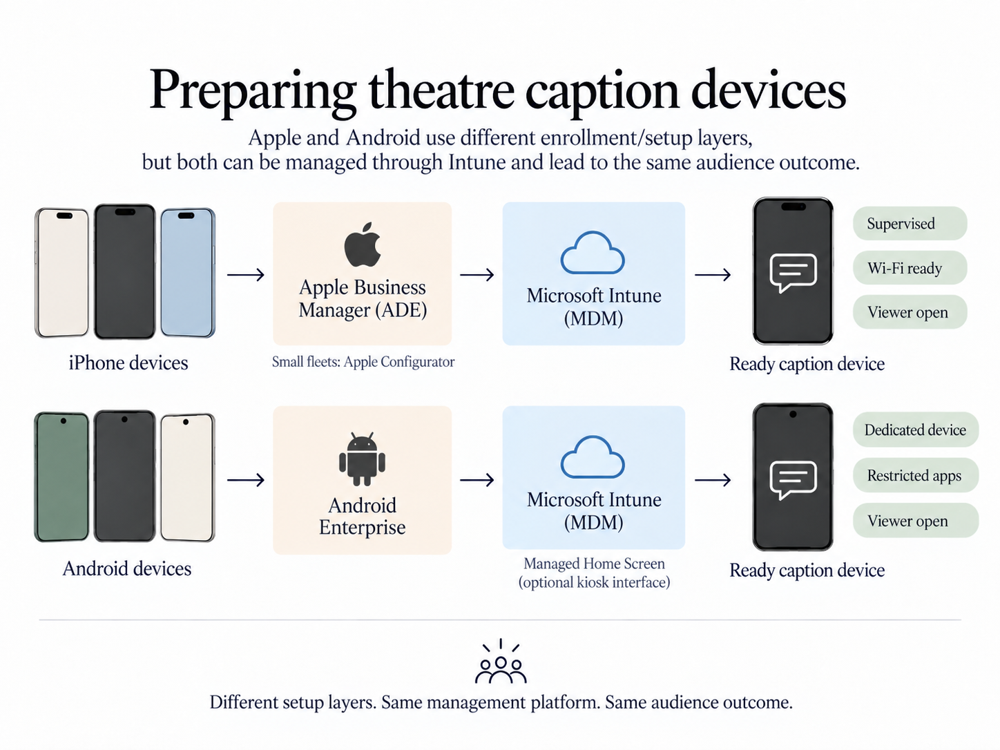
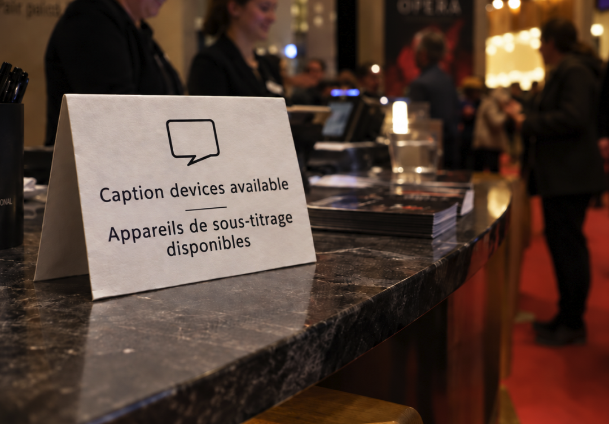

A theatre has one advantage that a visiting company does not: it is still there after the production leaves.

That makes a difference when planning access.

A company may arrive with translated text, an operator and a clear surtitling plan. Another may have only some of those things. If the audience-facing part of the service has to be rebuilt for every production, the result will vary from show to show.

A venue can remove some of that uncertainty. It can own a small pool of caption phones, configure them in advance, train front-of-house staff and establish a standard handover procedure. SurtitleLive can then provide the link between the prepared subtitle material and the audience.

The useful idea is not that every patron should use a phone. It is that **a theatre can make personal subtitle delivery part of its own equipment and operating practice**.

## The theatre can provide the device

SurtitleLive Viewer works in a browser. An audience member can open a link or scan a QR code without installing a dedicated app.

For many people, using their own phone will be the easiest option. But a venue does not have to make personal ownership of a smartphone a condition of access.

A theatre could keep, for example, ten or twenty inexpensive smartphones as loan devices, with a few spares. They would be handled like other house equipment: charged, numbered, checked before the performance, issued at front of house and collected afterwards.

This is useful for patrons who do not have a suitable phone, have little battery, do not want to use a personal device in the auditorium, or simply prefer equipment supplied by the venue.

The theatre does not need a device for every seat. It can start with a modest pool and expand according to real demand.

## Make the phone behave like a caption receiver

A loan device should not feel like somebody else's smartphone.

The venue can remove most of the distractions before it ever reaches a patron. Wi-Fi can be configured in advance. Notifications can be disabled. Unnecessary apps can be hidden or restricted. A shortcut to the caption service can sit on the Home Screen.

Organisation-owned devices can also be centrally managed.

A theatre using organisation-owned iPhones could enrol them through Apple Business Manager's Automated Device Enrollment and supervise or manage them with an MDM such as Microsoft Intune. A smaller fleet could be prepared manually with Apple Configurator and then enrolled in the theatre's device-management service. On Android, Android Enterprise supports dedicated-device and kiosk-style deployments; Intune's Managed Home Screen can provide a restricted home screen with only approved apps and settings.

The technical objective is straightforward: the patron should receive a device that is already on the right network and needs very little explanation.

For SurtitleLive, the simplest procedure may be to open the correct Viewer page on every loan phone before doors open. The patron then receives the device at the language-selection or subtitle screen rather than at a browser Home page.

## Deal with the light, not just the software

Phones in a dark auditorium need physical preparation too.

A privacy or anti-spy screen protector can narrow the display's viewing angle, reducing how much bright content is visible to neighbouring seats. It does not make the screen invisible, so the theatre should still test brightness, font size, reflections and reading angle in the auditorium itself.

A dark case, controlled brightness and a privacy filter may be enough to make a small screen far less distracting while keeping it readable for the person using it.

This is worth testing from adjacent seats before the service is advertised.

## Front of house matters more than the QR code

The audience experience will usually be decided in the foyer, not in the software.

Before a performance, front-of-house staff should know which devices are ready, which Viewer page belongs to that evening's show, which languages are available and what to do if a phone fails.

The handover can be simple:

> "This phone shows tonight's surtitles. Choose your language here and return the device after the performance."

That is enough. The patron does not need to know what a deployment, Viewer URL or runtime is.

A venue can also prepare the same service for people using their own phones, with a QR code or short link at the box office, access desk or auditorium entrance. Loan devices and bring-your-own-device access can coexist.

## Train staff once, reuse the knowledge

For a visiting company, every venue can be a new operating environment. For the theatre, the staff and building are familiar.

That makes training valuable.

Front-of-house staff only need to learn the audience side: where the devices are kept, how to check that the correct page is open, how language selection works and how to replace a failed handset.

A smaller number of technical or access staff can learn the SurtitleLive workflow in more detail: deploying a prepared show, checking Viewer access, understanding how mobile viewing and projection relate to the same subtitle material, and rehearsing operator cueing.

SurtitleLive's operation is deliberately straightforward, but the real advantage is consistency. Once a theatre has a written procedure, each new production starts with an existing house workflow rather than another improvised solution.

## SurtitleLive is one part of the service

SurtitleLive can handle prepared subtitle text, multiple language tracks, live human-controlled cueing, projection and browser-based audience delivery.

It does not provide the theatre's phones, network, translators, caption writers or access staff. Nor does it certify that a particular arrangement meets every accessibility or legal requirement.

That is not a weakness. It is a useful boundary.

The venue supplies the infrastructure and audience service. The production supplies the text, translation and artistic decisions. SurtitleLive connects those pieces during the performance.

A theatre may still use projected surtitles, professional captioning, sign-language interpretation, hearing-assistance systems or other access services where they are more appropriate. Personal screens are another option, not a replacement for everything else.

## The more useful question

For a theatre, the question is not only:

**"Can this production provide surtitles?"**

It is also:

**"Can our venue support a captioned performance when a production needs it?"**

A small fleet of managed phones, a tested network, trained front-of-house staff and a familiar SurtitleLive workflow can make the answer much easier.

That is where SurtitleLive becomes more interesting to a venue. Not as a piece of software bought for one show, but as part of a house system that can be used again across a season.

[Explore SurtitleLive](https://surtitlelive.com) and consider whether a small managed caption-device pool could fit your venue's existing access provision.
