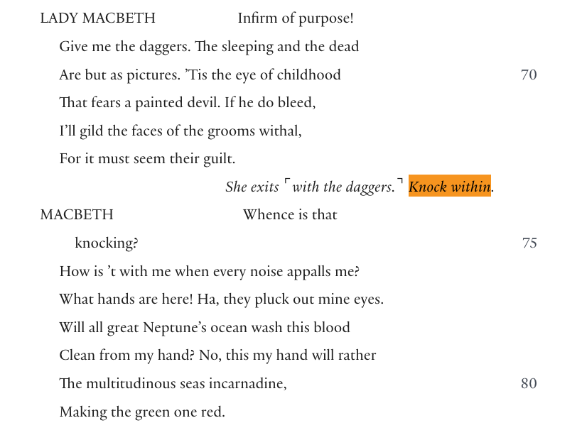

In Act 2, Scene 2 of *Macbeth*, Duncan has just been murdered. Lady Macbeth leaves with the daggers. In the excerpt shown here, the stage direction reads *Knock within.* Macbeth immediately asks, **“Whence is that knocking?”** and then, **“How is ’t with me when every noise appalls me?”** The direction identifies a sound; Macbeth’s words show his response to it. Both matter to the moment, but only one is spoken dialogue.

The excerpt shows a production instruction and Macbeth’s spoken response to the same moment. A caption editor must consider the sound in the actual production before deciding what an audience member who does not hear it needs to read.

That is the kind of information an **accessibility caption** is meant to make available.

SurtitleLive Editor now includes a dedicated manual line type for Accessibility Captions. A production can identify an important auditory event as audience-facing information rather than forcing it into dialogue or stage directions. During the show, it behaves like a caption cue and is displayed in brackets, for example:

**[knocking at the door]**

The change looks small in an editor. It solves a much larger problem in how theatrical information is classified.

## What is an accessibility caption?

Captions are often described as text versions of speech. That is only part of the job.

W3C’s Web Accessibility Initiative describes captions as synchronized text for speech **and non-speech audio information needed to understand the content**. It notes that captions may include sound effects, music, laughter, speaker identification and location. [See W3C’s captions guidance](https://www.w3.org/WAI/media/av/captions/).

Theatre captioning practice makes the distinction concrete. Stagetext says its theatre captioners prepare from the script and add essential information such as sound effects, character accents and off-stage sounds. Its guidance on surtitles describes a different purpose: they generally translate foreign-language performances for hearing audiences and do not typically include access information such as character names or off-stage sound descriptions. [Read Stagetext’s theatre-captioning guidance](https://www.stagetext.org/for-venues/theatre-captioning/) and [its explanation of captions, subtitles and surtitles](https://www.stagetext.org/about-us/faqs/).

A stage direction and an accessibility caption can refer to the same theatrical event, but they are not the same kind of information. The direction tells the production what to stage; the caption tells the audience what meaningful sound they may otherwise miss. The script can be the starting point, but the caption must be checked against the sound and staging of the actual production.

W3C, DCMP and Stagetext describe caption content and practice; they do not require all software to use a particular internal label or data model. **Accessibility Caption** is SurtitleLive’s product-specific name for a manual line type. Another tool could represent the same distinction with a tag, style, cue class or other metadata. The value of SurtitleLive’s `character / stage_direction / accessibility_caption` model is that those meanings can drive different output behavior; it is a product architecture choice, not a universal industry taxonomy.

In theatre, that can include a knock at the door, an alarm, breaking glass, an offstage crowd, a telephone, a gunshot, or a change in music whose meaning affects the scene.

The test is not simply whether a sound exists. It is whether the sound carries information.

There is a substantial difference between seeing Macbeth become frightened and also receiving the sound information that prompted his response. If the production establishes a door knock, a caption might read:

> [knocking at the door]
>
> Macbeth freezes.

The second version tells the audience what has provoked the reaction. It preserves a piece of the dramatic logic that was originally delivered through sound.

For the broader distinction between captions, subtitles and surtitles, see [our theatre terminology guide](https://surtitlelive.com/blog/11-captions-vs-surtitles-edinburgh-fringe/).

## Much of the raw material is already in the script

Accessibility captioning does not require playwrights to write an entirely separate play.

Scripts already contain a great deal of information beyond dialogue. Stage directions may record entrances and exits, knocks, telephone rings, gunshots, music, fights, voices from offstage, crowd noise and other events that shape a performance.

Among Shakespeare’s economical stage directions are *Knock within.* and *A noise within.* He also uses musical or ceremonial cues; contemporary scripts may specify sound and technical events in far more detail.

But an important distinction remains:

**A script containing stage directions does not mean it already contains finished accessibility captions.**

Stage directions are primarily production information. They help actors, directors, stage managers and designers understand what is meant to happen.

Accessibility captions are audience information. They answer a different question:

**What does a person who cannot fully hear this moment need to know in order to follow it?**

The same theatrical event can therefore produce two different pieces of writing. The stage direction is production information; the accessibility caption is audience information. They may share a source, but they serve different readers and purposes.

## A stage direction can be the source without being the final caption

Return to *Macbeth*.

The excerpt used here gives the production cue:

> *Knock within.*

A stage direction is a prompt to investigate the sound, not a ready-made caption. *Knock within.* signals a knock from offstage, but it does not tell the caption editor exactly how the sound is realized for the audience in this production. If the door is clear in the actual sound or staging, **[knocking at the door]** may fit. If the knock is rapid, **[rapid knocking at the door]** may fit. If the production establishes only that the knock is offstage, **[knocking offstage]** may be the more accurate description. If even that detail is uncertain, keep the caption more neutral. The right wording comes from reviewing and listening to the actual production—not translating the direction into a more specific claim.

Captions should describe the sound the audience actually hears, not interpret what it symbolizes. Stagetext’s guidance calls for brief, factual sound descriptions that remain within the world of the play or video. DCMP says bracketed sound-effect descriptions should identify the source when it is not clear from the picture, and that sound effects should be captioned when needed for understanding or enjoyment. [Read Stagetext’s Digital Subtitling Guidelines](https://www.stagetext.org/wp-content/uploads/2021/09/Digital_subtitling_Guidelines.pdf) and [DCMP’s sound-effects guidance](https://dcmp.org/learn/captioningkey/602).

For example, **[knocking at the door]** is appropriate only if the door is clear in the actual sound or staging. **[rapid knocking at the door]** adds a rhythm and should be used only if the knock is rapid. **[knocking offstage]** can describe an offstage sound without inventing a location beyond the stage. **[urgent knocking from outside]** adds both urgency and an outside location; the stage direction alone does not establish either. A caption such as **[Macbeth’s guilt closes in on him]** goes further still: it interprets the drama rather than describing the audible event.

The stage direction answers: **What is called for in the script?**

The accessibility caption answers: **What does the audience need to understand?**

That is why copying every stage direction directly into an audience display is rarely a good accessibility strategy. Many stage directions do not need to be shown to the audience at all. Others point to a sound that a captioner should review in the production and describe for the audience.

## *Hamlet* shows the same distinction

There is a useful example in Act 4, Scene 5 of *Hamlet*. Claudius and Gertrude are discussing the political danger surrounding Polonius’s death and Laertes’s return when the text gives the direction **“A noise within.”** Gertrude asks what the noise is. A messenger rushes in to warn the King that Laertes and a crowd are forcing their way in. The noise returns as the crowd presses toward the doors. [Read *Hamlet*, Act 4, Scene 5 at MIT Shakespeare](https://shakespeare.mit.edu/hamlet/hamlet.4.5.html).

A hearing audience may perceive the danger before the messenger explains it: first the disturbance, then the characters’ reaction, then the explanation.

If a production builds the sound from distant unrest into a crowd approaching the doors, appropriate accessibility captions might be:

> **[crowd noise]**

and later:

> **[the crowd draws closer]**

Neither caption needs to be a literal translation of **“A noise within.”** The caption should describe the significant sound that the audience is actually experiencing in that production.

## Why this was awkward in SurtitleLive before

Before this update, the Editor did not have a separate Accessibility Caption line type.

A production that wanted to add an audience-facing sound cue effectively had two imperfect choices.

The first was to treat it as dialogue. That ensured the line reached the audience, but the data model was wrong: nobody had spoken the words **[knocking]**. On a large script, sound information could become mixed among character dialogue and translations.

The second option was to mark it as a stage direction. That looked more faithful to the source script, but it created a different problem. In the operator console, the **Skip Stage Directions** control skips stage-direction cues during normal Next/Previous navigation.

If an accessibility caption were classified as a stage direction, it could be skipped along with them.

For the operator, that is one skipped cue. For an audience member relying on the caption, it could be the sound information that explains the next line or action.

## Three kinds of information can now remain distinct

SurtitleLive Editor now separates these roles explicitly:

| Line type | What it represents | Audience-facing? | During normal Next/Previous navigation |
| --- | --- | --- | --- |
| Character | Spoken dialogue | Yes | Remains in the cue sequence |
| Stage Direction | Script and production instructions | Usually not | Skipped |
| Accessibility Caption | Important non-speech auditory information for the audience | Yes | **Remains in the cue sequence** |

A *Macbeth* sequence can therefore be structured cleanly:

**Stage Direction**

> Lady Macbeth exits with the daggers.

**Accessibility Caption**

> knocking

**Character — Macbeth**

> Whence is that knocking?

These lines refer to the same dramatic moment, but they are different kinds of information. Lady Macbeth’s exit is a production direction. The knock is an auditory event that may need an audience-facing caption after the production is reviewed. Macbeth’s words are dialogue. One event can therefore be represented differently for the production team and the audience.

SurtitleLive’s three line types are a product data model, not a taxonomy required by captioning standards. Their value is practical: the meanings can drive distinct behavior, so an ASM operator can skip stage-direction cues during normal navigation without skipping an Accessibility Caption. Other software can make the same distinction with tags, metadata, styles or cue classes.

The separate **Hide Character Names** option controls whether character names appear; it does not determine whether an Accessibility Caption is kept.

The editor recording includes a production-specific sample description. It demonstrates the separate line type; it is not a recommended caption for *Knock within.* A caption should match the sound in the actual production.

## Skip stage directions without skipping accessibility captions

This is the most important practical consequence of the new line type.

Accessibility Captions are audience cues, not production-only stage directions. In the operator console, **Skip Stage Directions** skips stage-direction cues during normal Next/Previous navigation, while Accessibility Captions remain in that cue sequence and can be sent to the audience.

This describes normal cue navigation; a direct jump to a specific cue is a separate operator action.

That distinction lets the operator move past production directions without accidentally skipping sound information deliberately prepared for Deaf and hard-of-hearing audience members.

## Brackets are presentation, not content storage

Accessibility Captions are displayed in brackets:

> **[knocking]**

> **[thunder in the distance]**

> **[music stops abruptly]**

Brackets are a common captioning convention for sound information, not a universal software requirement. The Described and Captioned Media Program’s Captioning Key recommends bracketed descriptions for sound effects that are necessary to understand or enjoy the material. [See the DCMP guidance on sound effects](https://dcmp.org/learn/captioningkey/602).

SurtitleLive now handles that presentation consistently. The Editor can store the wording itself — for example, `knocking` — and render one pair of brackets when the cue is shown in simulations, projections and audience views.

If the text already contains brackets, SurtitleLive does not add another pair.

That keeps the content separate from its display convention and prevents authors from having to manage punctuation merely to obtain the correct on-screen appearance.

## Not every stage direction should become an accessibility caption

The new line type is not an instruction to put every stage direction on screen.

If a script says that Macbeth crosses to a table and the action is plainly visible, turning that direction into **[Macbeth crosses to the table]** is usually not sound captioning. It begins to enter a different access practice: describing visual information.

Music presents a similar editorial question. A script may say that soft music continues. Whether that needs a caption depends on what the music means in the actual production. If it is merely atmospheric, it may add little. If its sudden appearance or disappearance changes the meaning of the scene, it may be essential.

A better question is:

**If the audience member does not hear this sound, will they lose information needed to understand the moment?**

That principle is consistent with established captioning practice. The DCMP Captioning Key recommends captioning sound effects when they are necessary for understanding or enjoyment, rather than transcribing every audible event. [See the DCMP guidance on sound effects](https://dcmp.org/learn/captioningkey/602).

## SurtitleLive does not make the editorial decision for you

Accessibility Caption is a **manual** Editor line type.

SurtitleLive does not see the direction *Knock within.* and automatically decide that it must become a caption. That is deliberate. The line is a prompt for the caption editor to review the production’s sound, not a command to translate the stage direction into a predetermined caption.

The same direction can mean different things in different productions. **“A noise within”** might become a few people arguing backstage, a crowd breaking through the doors, or something else entirely. Music might be incidental in one staging and a crucial story cue in another.

The software does not know what the director and sound designer have finally made.

The production team does.

SurtitleLive’s job is therefore not to guess accessibility. It is to give the team a correct place to record the accessibility decision once they have made it.

A row can now mean, unambiguously:

**This is a stage direction.**

or:

**This is auditory information the audience should receive.**

Those are no longer forced into the same category.

## A small line type fixes a larger conceptual problem

Play scripts have always contained dialogue, action, sound and production information. But the tradition of writing a stage direction does not necessarily ask, at the same moment, how a Deaf or hard-of-hearing audience member will receive the information carried by that sound.

Accessibility captioning adds that audience perspective.

It asks the production to look again:

Which sounds are merely atmosphere?

Which sounds move the story forward?

Which sounds explain a character’s reaction?

Which moments lose meaning if the information can only be heard?

The knocking in *Macbeth* has been in the play for centuries. The stage direction was never missing.

What accessibility work adds is not a direct translation from:

> **Knock within.**

to a fixed caption. It is the editorial step of reviewing the production and, when the sound carries information the audience needs, writing a caption that describes that sound. Depending on what the audience hears and what the production establishes, an editor might choose **[knocking at the door]**. If the knock is rapid, **[rapid knocking at the door]** may be accurate; if the production establishes no more than an offstage knock, **[knocking offstage]** may be safer. The wording is grounded in the actual production, not inferred from the stage direction alone.

SurtitleLive Editor now has a dedicated place to preserve that decision.

---

Much of the raw material for accessibility captions is already present in play scripts.

The new feature is not about reinventing *Knock within.*

It is about giving a production a clear place to answer a different question:

**For the audience member who does not hear that knock, what should we show instead?**

### References

- [W3C: Captions](https://www.w3.org/WAI/media/av/captions/)
- [Stagetext: Theatre Captioning](https://www.stagetext.org/for-venues/theatre-captioning/)
- [Stagetext: Captions, subtitles and surtitles](https://www.stagetext.org/about-us/faqs/)
- [Stagetext: Digital Subtitling Guidelines](https://www.stagetext.org/wp-content/uploads/2021/09/Digital_subtitling_Guidelines.pdf)
- [MIT Shakespeare: *Hamlet*, Act 4, Scene 5](https://shakespeare.mit.edu/hamlet/hamlet.4.5.html)
- [DCMP: Sound Effects and Music](https://dcmp.org/learn/captioningkey/602)
