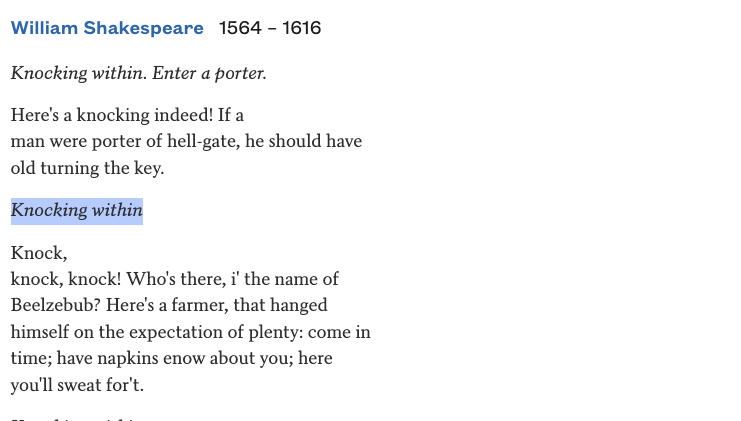
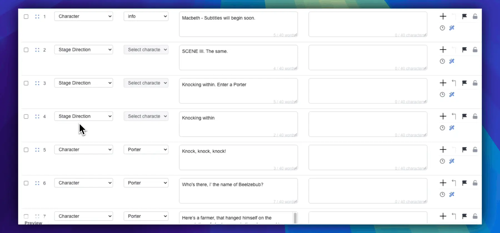

In Act 2, Scene 2 of *Macbeth*, Duncan has just been murdered. Lady Macbeth leaves with the daggers, and the rehearsal text used for this example gives the terse stage direction as *Knocking within*. Macbeth immediately reacts: **“Whence is that knocking?”** The knocking returns, Lady Macbeth hears it too, and the next scene carries it forward until the Porter opens the gate and Macduff enters the castle.

The sound is not decoration. It tells the audience that the outside world is closing in while Macbeth has almost no time left to conceal what he has done. The Folger Shakespeare Library edition prints the direction as *Knock within*; wording varies between editions, but Folger makes the sequence explicit: the knock appears immediately after Lady Macbeth exits with the daggers, then recurs through the end of the scene. [Read *Macbeth*, Act 2, Scene 2 at Folger](https://www.folger.edu/explore/shakespeares-works/macbeth/read/2/2/).

*The excerpt shows the stage direction in the text used for this example; the Folger edition cited above reads “Knock within.”*

A hearing audience receives that information before anyone explains it. A Deaf or hard-of-hearing audience member who does not receive the knock may still follow the plot, but part of the dramatic cause-and-effect has gone missing.

That is the kind of information an **accessibility caption** is meant to preserve.

SurtitleLive Editor now includes a dedicated manual line type for Accessibility Captions. A production can identify an important auditory event as audience-facing information rather than forcing it into dialogue or stage directions. During the show, it behaves like a caption cue and is displayed in brackets, for example:

**[urgent knocking from outside]**

The change looks small in an editor. It solves a much larger problem in how theatrical information is classified.

## What is an accessibility caption?

Captions are often described as text versions of speech. That is only part of the job.

The Web Content Accessibility Guidelines define captions as a synchronized text or visual alternative for both speech **and non-speech audio information needed to understand the content**. W3C specifically notes sound effects, music, laughter, speaker identification and location among the information captions may need to convey. [See W3C’s captions guidance](https://www.w3.org/WAI/media/av/captions/).

In theatre, that can include a knock at the door, an alarm, breaking glass, an offstage crowd, a telephone, a gunshot, or a change in music whose meaning affects the scene.

The test is not simply whether a sound exists. It is whether the sound carries information.

There is a substantial difference between seeing Macbeth become frightened and seeing:

> [urgent knocking from outside]
>
> Macbeth freezes.

The second version tells the audience what has provoked the reaction. It preserves a piece of the dramatic logic that was originally delivered through sound.

For the broader distinction between captions, subtitles and surtitles, see [our theatre terminology guide](https://surtitlelive.com/blog/11-captions-vs-surtitles-edinburgh-fringe/).

## Much of the raw material is already in the script

Accessibility captioning does not require playwrights to write an entirely separate play.

Scripts already contain a great deal of information beyond dialogue. Stage directions may record entrances and exits, knocks, telephone rings, gunshots, music, fights, voices from offstage, crowd noise and other events that shape a performance.

Shakespeare’s texts contain economical directions such as **“Knocking within”** (printed as **“Knock within”** in the Folger edition), **“A noise within”** and musical or ceremonial cues. Contemporary scripts may specify sound and technical events in far more detail.

But an important distinction remains:

**A script containing stage directions does not mean it already contains finished accessibility captions.**

Stage directions are primarily production information. They help actors, directors, stage managers and designers understand what is meant to happen.

Accessibility captions are audience information. They answer a different question:

**What does a person who cannot fully hear this moment need to know in order to follow it?**

The same theatrical event can therefore produce two different pieces of writing.

## A stage direction can be the source without being the final caption

Return to *Macbeth*.

The rehearsal text used here says:

> *Knocking within*

A literal caption such as **[knocking within]** is possible, but it may not be the clearest audience-facing description of the sound created by a particular production.

If the sound design makes it clear that somebody is pounding urgently at the castle entrance, a more useful caption might be:

> **[urgent knocking from outside]**

The stage direction answers: **What happens in the production?**

The accessibility caption answers: **What does the audience need to understand?**

That is why copying every stage direction directly into the surtitles is rarely a good accessibility strategy. Many stage directions do not need to be shown to the audience at all. Others contain the raw material for a caption but need to be rewritten from the audience’s point of view.

## *Hamlet* shows the same distinction

There is a useful example in Act 4, Scene 5 of *Hamlet*. Claudius and Gertrude are discussing the political danger surrounding Polonius’s death and Laertes’s return when the text abruptly gives the direction **“A noise within.”** Gertrude asks what the noise is. A messenger rushes in to warn the King that Laertes and a crowd are forcing their way in. The offstage noise returns before Laertes enters. [Read *Hamlet*, Act 4, Scene 5 at Folger](https://www.folger.edu/explore/shakespeares-works/hamlet/read/4/5/).

A hearing audience may perceive the danger before the messenger explains it: first the disturbance, then the characters’ reaction, then the explanation.

If a production builds the sound from distant unrest into a crowd approaching the doors, appropriate accessibility captions might be:

> **[crowd noise outside]**

and later:

> **[the crowd draws closer]**

Neither caption needs to be a literal translation of **“A noise within.”** The caption should describe the significant sound that the audience is actually experiencing in that production.

## Why this was awkward in SurtitleLive before

Before this update, the Editor did not have a separate Accessibility Caption line type.

A production that wanted to add an audience-facing sound cue effectively had two imperfect choices.

The first was to treat it as dialogue. That ensured the line reached the audience, but the data model was wrong: nobody had spoken the words **[urgent knocking from outside]**. On a large script, sound information could become mixed among character dialogue and translations.

The second option was to mark it as a stage direction. That looked more faithful to the source script, but it created a different problem. SurtitleLive can skip stage directions during a performance when those directions are useful in the working script but are not intended for the audience.

If an accessibility caption was classified as a stage direction, it could disappear with them.

For the operator, that was one skipped row. For the audience member relying on the caption, it could be the event that explains the next line or action.

## Three kinds of information can now remain distinct

SurtitleLive Editor now separates these roles explicitly:

| Line type | What it represents | Audience-facing? | When stage directions are skipped |
| --- | --- | --- | --- |
| Character | Spoken dialogue | Yes | Remains visible |
| Stage Direction | Script and production instructions | Usually not | Can be skipped |
| Accessibility Caption | Important non-speech auditory information for the audience | Yes | **Remains visible** |

A *Macbeth* sequence can therefore be structured cleanly:

**Stage Direction**

> Lady Macbeth exits with the daggers.

**Accessibility Caption**

> urgent knocking from outside

**Character — Macbeth**

> Whence is that knocking?

These lines belong to the same dramatic moment, but they do different jobs. Lady Macbeth’s exit is visible stage action. The knock is auditory information. Macbeth’s words are dialogue.

They no longer need to share the same type simply because they appear next to one another in the script.

The separate **Hide Character Names** option controls whether character names appear; it does not determine whether an Accessibility Caption is kept.

*A short editor recording showing the stage direction and audience-facing Accessibility Caption as separate lines.*

## Skipping stage directions no longer removes accessibility captions

This is the most important practical consequence of the new line type.

Accessibility Captions are treated as audience caption cues, not as production-only stage directions. If a production enables **Skip Stage Directions**, ordinary stage directions can still be omitted while Accessibility Captions remain in the show.

The distinction carries through SurtitleLive’s simulation, operator workflow, projection output and audience view.

That allows a production to keep unnecessary working directions off the audience display without accidentally suppressing information that was deliberately written for Deaf and hard-of-hearing audience members.

## Brackets are presentation, not content storage

Accessibility Captions are displayed in brackets:

> **[urgent knocking from outside]**

> **[thunder in the distance]**

> **[music stops abruptly]**

Brackets are a widely used captioning convention for sound information. The Described and Captioned Media Program’s Captioning Key, for example, recommends bracketed descriptions for sound effects that are necessary to understand or enjoy the material. [See the DCMP guidance on sound effects](https://dcmp.org/learn/captioningkey/602).

SurtitleLive now handles that presentation consistently. The Editor can store the wording itself — for example, `urgent knocking from outside` — and render one pair of brackets when the cue is shown in simulations, projections and audience views.

If the text already contains brackets, SurtitleLive does not add another pair.

That keeps the content separate from its display convention and prevents authors from having to manage punctuation merely to obtain the correct on-screen appearance.

## Not every stage direction should become an accessibility caption

The new line type is not an instruction to put every stage direction on screen.

If a script says that Macbeth crosses to a table and the action is plainly visible, turning that direction into **[Macbeth crosses to the table]** is usually not sound captioning. It begins to enter a different access practice: describing visual information.

Music presents a similar editorial question. A script may say that soft music continues. Whether that needs a caption depends on what the music means in the actual production. If it is merely atmospheric, it may add little. If its sudden appearance or disappearance changes the meaning of the scene, it may be essential.

A better question is:

**If the audience member does not hear this sound, will they lose information needed to understand the moment?**

That principle is consistent with established captioning practice. The DCMP Captioning Key recommends captioning sound effects when they are necessary for understanding or enjoyment, rather than transcribing every audible event. [See the DCMP guidance on sound effects](https://dcmp.org/learn/captioningkey/602).

## SurtitleLive does not make the editorial decision for you

Accessibility Caption is a **manual** Editor line type.

SurtitleLive does not see **“Knocking within”** and automatically decide that it must become a caption. That is deliberate.

The same direction can mean different things in different productions. **“A noise within”** might become a few people arguing backstage, a crowd breaking through the doors, or something else entirely. Music might be incidental in one staging and a crucial story cue in another.

The software does not know what the director and sound designer have finally made.

The production team does.

SurtitleLive’s job is therefore not to guess accessibility. It is to give the team a correct place to record the accessibility decision once they have made it.

A row can now mean, unambiguously:

**This is a stage direction.**

or:

**This is auditory information the audience should receive.**

Those are no longer forced into the same category.

## A small line type fixes a larger conceptual problem

Play scripts have always contained dialogue, action, sound and production information. But the tradition of writing a stage direction does not necessarily ask, at the same moment, how a Deaf or hard-of-hearing audience member will receive the information carried by that sound.

Accessibility captioning adds that audience perspective.

It asks the production to look again:

Which sounds are merely atmosphere?

Which sounds move the story forward?

Which sounds explain a character’s reaction?

Which moments lose meaning if the information can only be heard?

The knocking in *Macbeth* has been in the play for centuries. The stage direction was never missing.

What accessibility work adds is the step between:

> **Knock within.**

and:

> **[urgent knocking from outside]**

It is the step from production instruction to audience information.

SurtitleLive Editor now has a dedicated place to preserve that decision.

---

Much of the raw material for accessibility captions is already present in play scripts.

The new feature is not about reinventing *Knocking within*.

It is about giving a production a clear place to answer a different question:

**For the audience member who does not hear that knock, what should we show instead?**
