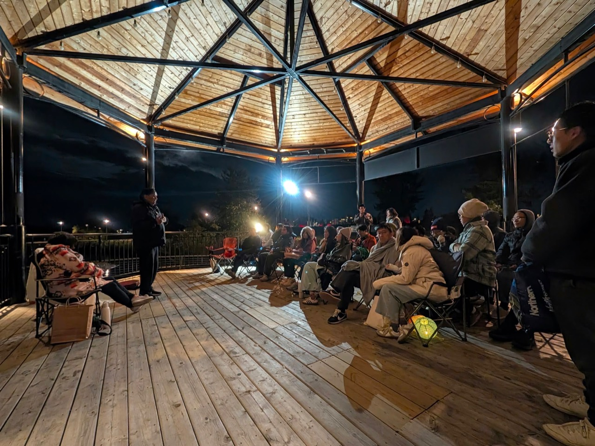
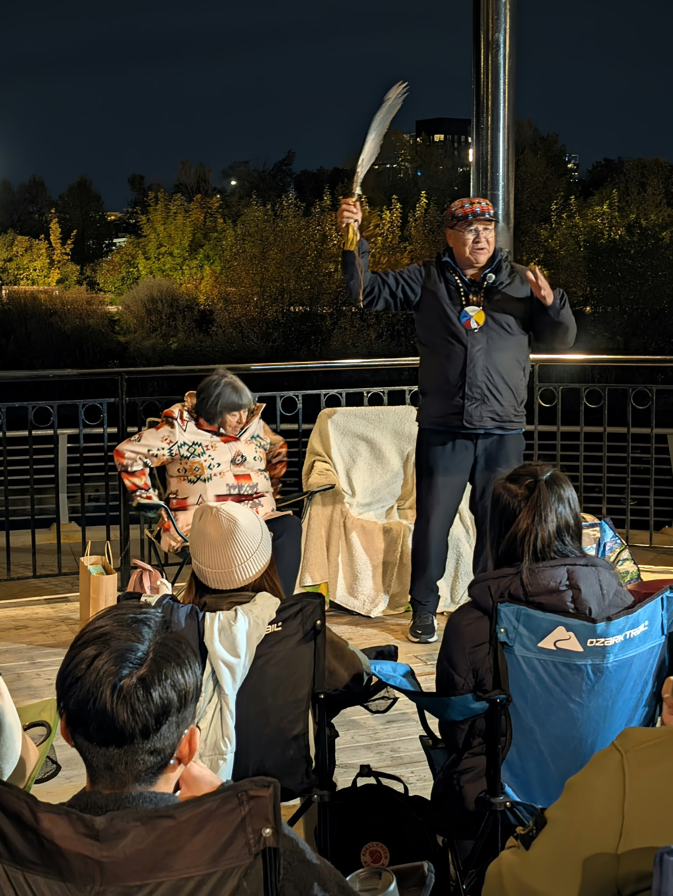
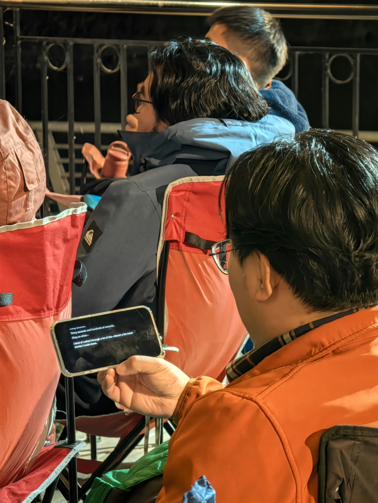
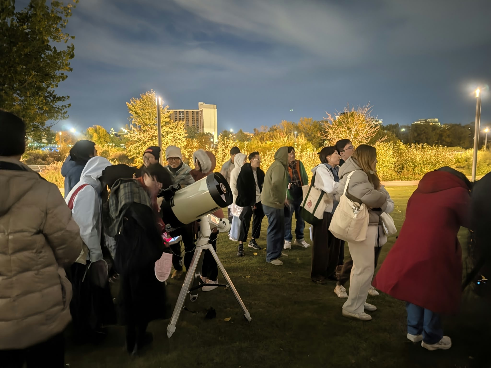
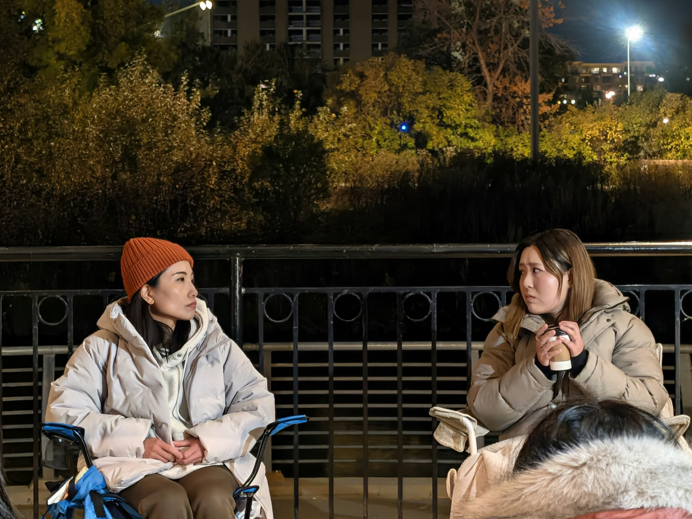

> **Editorial note:** Pockitle provided live captioning for portions of Scripts Under the Stars. This article documents and reflects on the public event. Quotations are drawn from remarks made during the event, and the inclusion of any speaker or participant should not be understood as an endorsement of Pockitle or SurtitleLive.

Before the first evening began, the clouds had not fully cleared.

By late September, Calgary was already cold after dark. The Music Pavilion is open on all sides, with folding chairs set out on its wooden platform. People arrived in coats and sat only a few steps from the speakers. Beyond the pavilion, the city lights were still visible. The Bow River was nearby.

It did not look like a promising night for stargazing. Later, the clouds opened. The moon became clear, and through a telescope people could see the rings of Saturn. The following afternoon brought rain and a sharp drop in temperature; by evening, the sky was almost completely clear.

The first evening fell on Mid-Autumn; the second came the night after.

**Scripts Under the Stars《仰望之間》** was held at the Music Pavilion in East Village as part of Calgary Culture Days. The pavilion stands along the RiverWalk near the Bow River and was designed as an open public place for people to gather. The wider East Village and Rivers District lie within **Moh’kinsstis**, a Blackfoot name for this place. The history beneath the pavilion is much older than the apartments, pathways, and downtown skyline around it.

The gathering itself was small. The place was not without a past.

## Walk this river together

Wilfred Day Rider spoke about his Blackfoot language and culture, and about land, the sun, the moon, plants, and animals. He described people not as separate from the world around them but as part of it. Without the sun, the moon, and Mother Earth, he said, people could not survive.

He put it simply:

> **“We are interconnected to everything.”**

These words were being spoken close to downtown Calgary. Roads, buildings, and city lights were only a short distance away. The river, the trees, and the night sky were there too.

The city was a later layer.

Marsha Hanson is Plains Cree and part of the Muskoday First Nation in Saskatchewan. That evening, she shared stories and teachings she had received from Cree Elders, including memories of looking at the night sky as a child.

She remembered sitting outside, talking about Orion and the Big and Little Dippers, and making up stories about what she saw. Stories, she said, were a way of carrying teachings.

Later, she told the people sitting in front of her:

> **“Walk this river together.”**

She welcomed people to the land, but she did not ask those who had arrived from elsewhere to put their own cultures away. She encouraged them to bring those cultures with them, to share them, and to take part in one another’s celebrations.

Walking the same river is not the same as having the same history.

The people inside the pavilion had come from different places. Some belonged to communities whose relationship with this land reaches back many generations. Some had moved to Calgary only a few years earlier. Some came from Hong Kong. Some were born in Canada. Some had come specifically for the event; others had been walking along the river and stopped when they saw people gathered there.

They did not share one language either. Some people spoke English; others spoke Cantonese. **English captions and Chinese translated captions were available for audience members who wanted to follow the spoken content in text.**

That did not have to become the subject of the evening. Language was simply another distance to cross. If one person was willing to speak and another was willing to listen, the practical question was how to keep that distance from ending the encounter too soon.

## Mid-Autumn and distance

For many Chinese families, Mid-Autumn is associated with reunion. But the idea of reunion already contains another fact: people separate.

Some stay where they were born. Some move to another city. Some live in another country for years and still think of an earlier home on particular days. The moon does not make those distances smaller. It has simply given people, for a very long time, a way to imagine that two people in different places might still look up and see the same thing.

When Hanson shared a story about the sun and moon, the host, who had come from Hong Kong, was reminded of Chinese stories about figures in the sky, separation, and reunion. He spoke about the similarities people sometimes recognize in one another’s stories, and about how rarely different communities actually have the chance to sit together.

The connection was natural, but similarity is not sameness.

Another person’s story does not have to become a version of something we already know before it is worth hearing. A Cree story does not need to become a Chinese story. One Hong Kong family’s experience does not stand for everyone who has left home.

Sometimes listening does not end with the discovery that *we are all the same*. It may simply mean learning that another person understands land, the moon, family, or leaving in a way we did not know before, and then allowing that story to remain theirs.

## Not knowing together

The original Cantonese play **《獵戶》**, whose title refers to Orion, was performed in the same pavilion.

Its setting is already spare: late September, outdoors, two sisters looking at the sky, with an old star map, a drink, and a red flashlight beside them. At the Music Pavilion, very little had to be built. Night was already behind the performers.

The play belongs to one family. It does not need to become a story about every immigrant family. But one line sat naturally within those two evenings.

A point of light moves across the sky. The younger sister asks where it is going. When they were children, the older sister would always invent an answer. Years later, she says she does not know. Then she says:

> **「而家我哋可以一齊唔知。」**  
> *“Now we can just not know, together.”*

There is no grand lesson in the line. The sisters have simply reached a point where they can be uncertain together.

Inside that small pavilion, the thought felt relevant. We may not fully understand what a story means inside a culture we do not know well. We may not know when someone who has recently moved to Calgary begins to call it home. We may not know what our own relationship to the land beneath us will eventually become.

Not knowing does not prevent people from sitting together.

The scale of the gathering mattered here. In a theatre of several hundred seats, a speaker looks out at an audience. At the Music Pavilion, speakers could see the people listening, and listeners could see one another. If someone laughed, the people nearby knew where the laughter came from. If someone paused, the pause remained in the same small space.

A story did not have far to travel.

Today, we often think of stories as books, films, recordings, or pieces of content that can be sent elsewhere. But before any of those forms existed, stories worked more simply: someone remembered something and told it; someone nearby stayed long enough to listen.

A story does not have to leave everyone with the same understanding. Sometimes it is enough that an experience no longer remains with only one person.

## It does not have to be a star

Near the end of **《獵戶》**, another point of light moves across the sky.

The younger sister says:

> 「嗰粒又飛緊。」  
> “That one is moving again.”

The older sister tells her it is not a star.

The younger sister asks:

> 「咁你又望。」  
> “Then why are you looking?”

The older sister answers:

> **「唔係星都可以望。」**  
> **“It doesn’t have to be a star to be worth looking at.”**

They remain seated. The red flashlight is switched off. The star map is still in her hands.

Orion has not yet risen.
