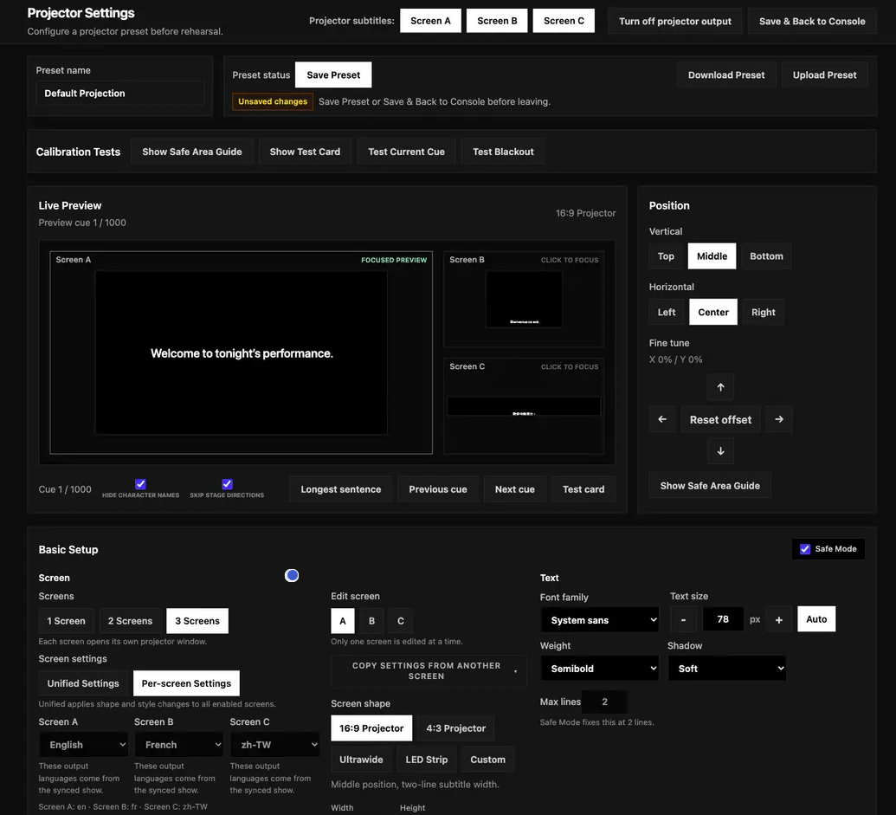
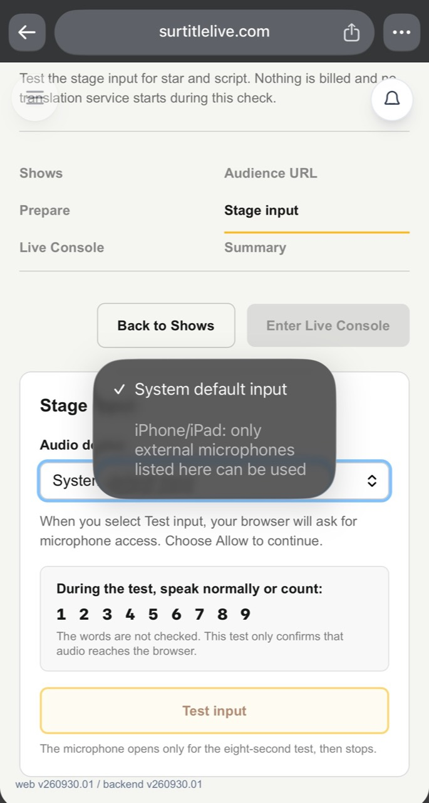
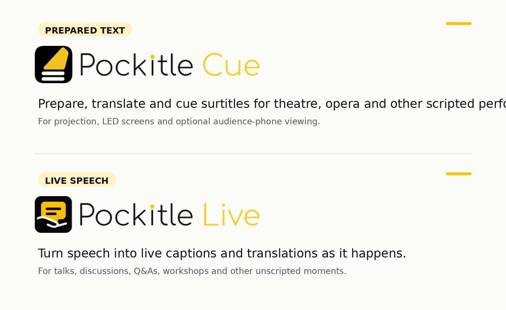

When we launched SurtitleLive in June, it began with a fairly specific job.

A production already had its text: a script, libretto, translated dialogue, or another set of captions prepared before the performance. The team needed somewhere to organise and review that material, rehearse the cue sequence, and then send each line to projectors, LED screens, or audience phones at the right moment.

That remains the most common way people use the product.

Since June, more than **200 caption deployments** have been created through SurtitleLive. They have included different kinds of performances and venues, different combinations of projected and personal-device captions, and different ways of working backstage.

But those first months also showed us that prepared surtitles are only one part of the problem.

In August, we introduced **Pockitle Live** for speech that cannot be prepared in advance: talks, post-show discussions, Q&As, workshops, improvised performance, and other situations where the words only exist once someone starts speaking.

At the same time, we kept hearing two practical questions.

What happens to projection if the venue internet fails?

And if live captioning can run from a phone or tablet, can that device take a proper feed from the venue mixer instead of simply listening through its built-in microphone?

Those questions have shaped what we are building next.

They have also made the old product name increasingly difficult to keep.

SurtitleLive is therefore becoming **Pockitle Cue**.

The software people have been using does not disappear. The account, projects, and core prepared-surtitling workflow remain. What changes is the name, and the clearer product family around it.

## Prepared text and speech happening now

We now make a deliberate distinction between two kinds of live text.

When the words exist before the performance, the appropriate tool is **Pockitle Cue**.

A theatre or opera company can prepare and translate the text, review each line, rehearse how it will move through the performance, and then have an operator cue it live. The timing remains a human decision because the wording, line breaks, translation, and exact moment a title appears are often part of the production itself.

When the words do not exist beforehand, the appropriate tool is **Pockitle Live**.

Pockitle Live listens to one live source language and generates captions as people speak, with the option to provide the original-language captions and translated caption outputs for the audience.

The two products may eventually put words on some of the same screens and phones, but they begin from fundamentally different material.

One begins with text that can be prepared.

The other begins with speech that is happening now.

Bringing both under the Pockitle name makes that distinction easier to explain.

## SurtitleLive becomes Pockitle Cue

For existing SurtitleLive users, Pockitle Cue is not a replacement product that requires starting again.

It is the new name for the same prepared-surtitling system.

Existing accounts continue. Existing projects continue. The browser remains the place to prepare scripts, work on translations, review lines, rehearse, deploy, and operate prepared surtitles.

The word **Cue** describes the part of the process that matters most once a performance begins.

A surtitle may have been written weeks earlier. On the night, however, someone still has to decide when that line belongs in the room.

That is the cue.

## The browser can already survive a network interruption. But that is not the whole problem.

One of the most consistent requests we have heard concerns venue connectivity:

**If the internet goes down, can the projected surtitles keep running?**

The current browser version of Pockitle Cue already has a form of local projection continuity.

Before the performance, the browser prepares the material needed for projection. If the operator console and projection windows remain open, local cueing and the already-open projection output can continue through a venue internet interruption.

That matters. A temporary loss of wide-area connectivity should not immediately remove the words from the stage.

But using a browser to achieve that continuity has also shown us its limits.

The operator needs to understand which windows must remain open, which parts of the system are still local, and which functions still depend on the cloud. An already-open projection window may continue responding, while reopening a window after it has been closed can require connectivity again.

Browser window management, fullscreen behaviour, display selection, and application lifecycle were never designed specifically for a projection computer in a theatre.

In other words, there is a difference between **being technically able to continue** and giving an operator a clear, predictable show-time environment.

That is the reason for **Pockitle Cue for Mac**.

## Pockitle Cue for Mac

Pockitle Cue for Mac is being developed as the show-time counterpart to Pockitle Cue in the browser.

Preparation still happens in the browser. Teams can work on the script, translations, reviews, and deployment there.

Before the performance, a completed show can then be synced to the Mac attached to the venue's projectors. Once synced, the show data needed for local operation is stored on that Mac, so projection can continue without depending on the venue internet connection during the performance.

That does not mean every Pockitle function becomes offline.

Audience phones and cloud-connected services still require internet access.

The distinction is intentional: a loss of venue internet should not, by itself, stop a locally synced projector from showing the next surtitle.

The Mac app also lets us treat displays as theatre outputs rather than generic browser windows. The current design supports up to three mapped outputs, each with its own language and display settings.

And it changes the way Pockitle can work with **QLab**.

Many theatre teams already run sound, video, and other show cues from QLab. Rebuilding the surtitle sequence separately creates another cue stack for the operator to maintain.

With Pockitle Cue for Mac, operators can select prepared surtitles in the Pockitle app and **drag them directly into a QLab cue list**.

The material prepared in Pockitle can therefore become part of the existing QLab workspace instead of being manually copied or rebuilt cue by cue.

That matters less as a technical feature than as an operating principle.

If a production already has a show-control workflow, surtitle software should fit into it where possible rather than ask the production to reorganise itself around the surtitle software.

Pockitle Cue for Mac is still in development, so we are treating these capabilities as work in progress rather than finished release promises.

But the direction is clear: the browser remains the place where the performance is prepared; the Mac app gives a prepared performance a more explicit local home for show time.

## Live captioning has a different hardware problem

Pockitle Live has exposed a different limitation.

For live captioning, recognition quality begins with the audio source.

A laptop can readily take a clean feed from a mixer or USB audio interface. In a theatre, conference, or event environment, that is usually preferable to placing a device in the room and asking its built-in microphone to listen to amplified speech.

Running Pockitle Live from a phone or tablet would make the operator much more mobile.

On Android, compatible browsers and devices can accept an external microphone or audio input through the browser, which makes some mobile live-captioning setups practical.

On iPhone and iPad, the browser path is more restrictive, but it would be inaccurate to say that iOS web apps can never use an external microphone. Pockitle Live Web can use an external input only when iOS exposes it in the browser's audio-input list. A connected microphone or mixer feed that does not appear there cannot be selected from the page. When no suitable external input is listed, the device's built-in microphone remains the dependable fallback.

This is not something we can fully solve by adding another selector to the web page. The browser can offer only the inputs iOS exposes to it; it cannot make every connected microphone, USB interface, or venue-mixer path appear, or provide the same input discovery and routing control as a native application.

For casual speech, the built-in microphone may be enough.

For a performance or event, often it is not.

The clean speech signal already exists at the mixer. We should be able to use it.

## Pockitle Live for iOS

That is one of the main reasons we are developing **Pockitle Live for iOS**.

This is not simply the existing web interface placed inside an app.

A native iPhone and iPad application gives us direct access to the iOS audio system. The current design is centred on proper wired input paths, including supported USB audio interfaces and venue mixer feeds, so an operator can caption the signal the venue is already producing rather than recapturing the room through the device microphone.

The app is intended for the operator.

The audience experience does not need to become an app experience.

Audience members will still be able to open the caption link in their browser and choose from the languages made available for that event. They do not need to install Pockitle Live for iOS.

The native app exists because the person creating the captions has different requirements from the person reading them.

## Four products, one clearer structure

The Pockitle family is therefore taking shape around four products.

**Pockitle Cue** is the new name for SurtitleLive in the browser. It is for prepared surtitles: scripts and other text that can be translated, reviewed, rehearsed, and then cued during the performance.

**Pockitle Cue for Mac** is the Mac application currently in development for local projection. It is designed to sync a completed performance to the projection computer, continue local projection without depending on venue internet, manage dedicated display outputs, and work more directly with QLab — including dragging prepared surtitles from Pockitle into a QLab cue list.

**Pockitle Live** is the browser-based live-captioning tool introduced in August. It is for talks, post-show discussions, Q&As, workshops, readings, improvised work, and other speech that cannot be fully captioned in advance.

**Pockitle Live for iOS** is the iPhone and iPad application currently in development. One of its most important purposes is to provide a more dependable native route for external microphones, USB audio interfaces, and venue mixer feeds than the iOS browser environment can currently offer.

The products do different things because the situations are genuinely different.

Sometimes every word is known before the audience arrives.

Sometimes no one knows exactly what will be said.

Some venues have very stable internet connections.

Some do not.

Sometimes the right audio source is a laptop microphone.

Often, it is a cable coming out of a mixer.

Our job is not to pretend those situations are the same.

It is to make the differences manageable.

That is why SurtitleLive is becoming **Pockitle Cue**.

The prepared-surtitling tool we launched in June is still here.

It now has a name that makes more sense beside everything that has grown around it.
