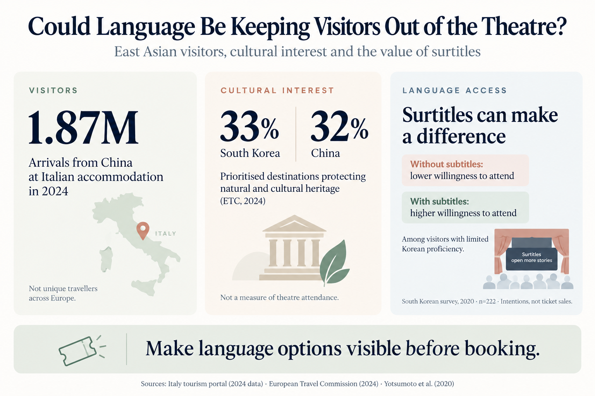

A visitor in London, Paris or Rome might love the idea of seeing a local play. Yet before buying a ticket, they face a practical question: **Will I understand enough to enjoy it?**

That question matters long before the curtain rises. A translation service hidden on an accessibility page cannot influence a visitor who never discovers it. South Korea offers a useful example of treating surtitles not merely as an on-the-night display, but as part of how audiences find, choose and attend performances.

## East Asian visitors are already travelling to Europe

There is a real audience to consider, even if it is difficult to count as one pan-European total. [Italy's national tourism portal reported approximately 1.87 million Chinese arrivals at tourist accommodation in 2024](https://portaleoperatori.italia.it/news/detail/?id=18). These are arrivals recorded in Italy, **not** 1.87 million unique people visiting Europe; multi-destination trips and differing national definitions make an all-Europe total hard to compare.

Interest in a destination's culture is also measurable, though it is not the same as demand for theatre tickets. In a [2024 European Travel Commission survey](https://etc-corporate.org/news/international-travellers-to-europe-prioritise-safe-destinations-and-affordable-prices-in-2024/), 33% of South Korean and 32% of Chinese respondents prioritised destinations that preserve natural and cultural heritage. That does not establish that one third would buy a theatre ticket. It does suggest that cultural programming has an audience worth welcoming.

The language barrier is more directly relevant. A [2020 study of 222 Chinese and Japanese respondents in South Korea](https://www.kci.go.kr/kciportal/ci/sereArticleSearch/ciSereArtiView.kci?sereArticleSearchBean.artiId=ART002605795) found that weaker Korean-language ability was associated with lower willingness to attend performances without subtitles, but greater willingness to attend performances with subtitles. This was a study of stated intentions in South Korea, **not** a European ticket-sales experiment. It nevertheless poses an important question for European venues: how many interested visitors are never reaching the checkout?

*The graphic brings together three different measures: accommodation arrivals in Italy, heritage preferences and stated attendance intentions in South Korea.*

## What South Korea has learned

South Korea was testing this idea well before today's personal-screen technology. In 2017, the Korea Tourism Organization [introduced tablet-based captions in English, Japanese and simplified Chinese](https://www.korea.net/NewsFocus/Culture/view?articleId=150428) for selected Daehak-ro performances, explicitly connecting language access to international visitors.

More recently, Orot Planet's **UNISTEP** has worked on making performance captions and translations a recurring service. In its [August 2025 first-year account](https://www.orotplanet.com/unistep_history), the team said UNISTEP had served more than 15 productions. It also described an unexpected pattern: a service initially built with deaf audiences in mind was being used especially often by foreign-language audiences. These are the provider's observations, not independently audited attendance figures.

The most revealing challenge in that account was operational rather than technical. Who would run the service? Who would pay? Could it continue after a one-off funded production? Those are familiar questions in any theatre.

## A subtitle service must be visible before the ticket is bought

The [KONTENX guide to Korean musicals with subtitles](https://www.kontenx.net/articles/subtitle_tutorial) shows why presentation matters. It tells readers which languages are supported, which dates offer the service, how subtitles appear and where to book. In some cases, a subtitle package has its own ticketing instructions or seating restrictions.

A European venue advertising only “surtitles available” leaves too much unanswered. Does that mean English translation of a French play, or French captions of French dialogue? Is Mandarin, Japanese or Korean available? Every night, or only on selected dates? Is a separate ticket required?

**Language access becomes useful to audience development when it is discoverable at the point of booking.** The show listing, ticketing page, tourism partner and front-of-house team should give the same clear answer.

## More languages need not mean a costly screen at every seat

This is where the economics can be more approachable than many venues assume.

As we explain in [Make Mobile Surtitles Part of Theatre Accessibility](https://surtitlelive.com/blog/20-why-theatres-should-treat-mobile-surtitles-as-house-equipment/), a theatre can offer browser-based personal surtitles on spectators' own phones. A QR code or link opens the **Pockitle Cue Viewer**; audiences do not need a dedicated viewing app. Instead of fitting a special display to every seat, the venue can start with a small pool of perhaps **10–20 affordable loan smartphones**, plus spares, and expand if demand justifies it.

The devices can be charged, configured and reused across a season. Test dim screens and privacy filters in the auditorium, make sure the network works, and train front-of-house staff to hand over a ready-to-use device. This approach can substantially reduce **initial hardware requirements** compared with a seat-by-seat installation; it does **not** make translation, caption editing, operators, staffing, connectivity or equipment maintenance free.

Crucially, audiences should be able to choose. Some prefer a shared projection screen, some want a personal language track, and others may not want subtitles at all. Translation surtitles and accessibility captions also serve overlapping but distinct needs: captions for deaf and hard-of-hearing patrons may need speaker and sound information beyond translated dialogue.

## Try a measured pilot rather than promise a box-office miracle

A small venue could choose one production or a few performances, prepare accurate Mandarin Chinese, Japanese and/or Korean translations where local demand warrants them, and announce the language options on the ticket page **before sales begin**. Offer personal viewing through tested phones, with a few loan devices for those who need them.

Then ask willing audience members how they discovered the service, whether it affected their booking decision and how well it worked. Track uptake, technical issues and the real staff and translation costs. These signals inform the next season, but self-reported interest should not be mistaken for proven incremental ticket sales.

**Pockitle Cue** can manage prepared multilingual text, human-controlled live cueing, projection and browser-based audience delivery. The production and venue remain responsible for translation quality, devices, network, staffing and appropriate access provision. No single delivery method replaces a complete accessibility plan.

The lesson from South Korea is not that every theatre should buy a new gadget. It is simpler: **a performance can keep its original language while making a genuine invitation to people who speak another one**. Sometimes the invitation begins not in the auditorium, but with a clearly labelled language option beside the ticket button.
