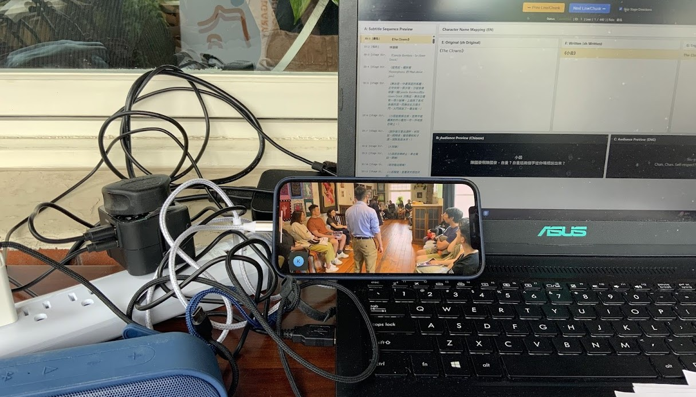

In the world of theatre, we often think of surtitles as a tool for "people who don’t speak the language." We think of them as a way to help tourists or international guests follow the story.

At SurtitleLive, we believe that providing a subtitle or surtitle track can do something much more powerful. It is not just about translation—it is about cultural inclusion and giving artists the freedom to be themselves.

## The Power of Your "Heart Language"

For many new immigrants and diaspora communities, moving to a new country like Canada or the UK means learning a new language. But when it comes to art, the most powerful stories are often told in one’s "heart language"—the language you grew up with.

Many immigrant artists feel they must perform in English to find an audience. This can sometimes make the art feel less authentic. By providing a high-quality subtitle experience, we change the game. We allow artists to:

*   **Perform with full emotion:** Actors can use their native tongue, where every nuance and cultural detail is preserved.
*   **Keep identity alive:** Heritage and history stay at the center of the performance.
*   **Share unique stories:** Nothing is "lost in translation" when the original voice is allowed to lead.

## Success Story: From Hong Kong to Calgary

Recently, we had the honor of supporting the Calgary Hong Kong Arts & Culture Association (CHACA) in Canada.

*The custom mode SurtitleLive built for the performance team.*

They wanted to perform an award-winning play from Hong Kong in its original Cantonese. In the past, this might have been a risk. Would people in Calgary who don't speak Cantonese come to see it?

The result was a beautiful bridge between cultures. By using SurtitleLive, the association provided a clear English subtitle stream directly to the audience’s devices. This achieved two incredible things:

1.  **It empowered the actors:** They performed a complex, emotional play in their own language, reaching the highest level of artistic quality.
2.  **It invited the local community in:** The show didn't just attract the local Hong Kong community; it also brought in local Calgary artists and theater-goers. They walked into the theatre as strangers to the language but left deeply moved by the story.

## How Technology Serves Humanity

We built SurtitleLive to be simple and affordable because we want every community—no matter how small—to be able to share their stories. Our technology is designed to stay in the background so the art stays in the front.

*   **Simplicity for Small Groups:** Immigrant arts organizations often have limited budgets. They can now run professional theatre subtitles from a simple laptop.
*   **Inclusive Spaces:** By using a "Bring Your Own Device" (BYOD) model, theaters can be set up anywhere, from community centers to professional stages, without expensive hardware.
*   **Respecting the Atmosphere:** Our "dark mode" ensures that the technology doesn't distract others, keeping the focus on the human connection happening on stage.

## The Bottom Line

Theatre is a place where we learn about each other. When we lower the language barrier, we don't just "help" an audience; we encourage new voices to speak loudly and proudly in their own tongue.

When language is no longer a barrier, theatre becomes what it was always meant to be: a meeting place for human stories.
