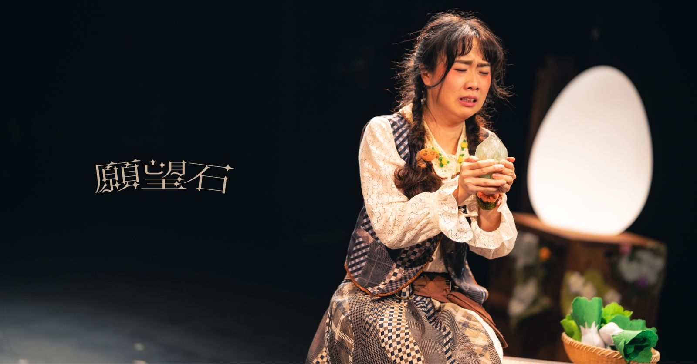

AI translation in 2026 is fast, fluent, and widely accessible. For many industries, that is enough.

For theatre, it is not.

AI can translate words. But theatre is built on intention, rhythm, and subtext—elements that cannot be generated through language prediction alone. The question is no longer whether AI can assist translation, but whether AI alone can carry a live performance across languages without losing its emotional core.

**AI optimizes for probability. Theatre lives in intention.**

## 1. Subtext Cannot Be Automated

In everyday communication, language is literal. On stage, language is layered.

A simple line such as “I’m fine” may signal reassurance, heartbreak, or concealed fear depending on what has happened earlier in the play. Its meaning is shaped by context, pacing, and performance.

AI translation models are designed to produce statistically likely phrasing. They do not experience narrative tension or track emotional callbacks across acts. As a result, automated translation often becomes clearer—but dramatically flatter.

*   **Metaphor** becomes literal.
*   **Ambiguity** becomes explanation.
*   **Poetry** becomes information.

The words may survive translation. The intention may not.

### Example: When Translation Is Correct but Not True

Consider a line from the Hong Kong play *The Wishing Stone* by playwright KK Lam, produced by Lamps Theatre. The line is spoken by the mother in the opening scene and serves as the emotional thesis that runs through the entire children’s play:

> 「一個人做錯既野，無一種魔法可以幫倒你。」

A generic AI translation might produce:
*“There is no magic that can fix the mistakes you have made.”*

This is linguistically accurate. But is it dramatically true?

Within the play, the line is not simply informational. It is spoken by a mother at a pivotal emotional moment in the first act, establishing the central moral thread that carries through the entire story. The delivery carries care, warning, and quiet finality.

A theatre-aware translation might instead render the line as:
*“No magic can undo what you’ve done.”*

The difference is subtle but crucial. The second version preserves rhythm, weight, and performative intention. It respects the breath and authority of the character speaking it. The first reads as explanation; the second feels like theatre.

This distinction illustrates a broader truth: AI can translate meaning, but it does not automatically translate dramatic intention. On stage, intention is everything.

*Theatre translation requires capturing the performative intention beyond just the literal words.*

## 2. Theatre Translation Has Physical Constraints

Surtitles are not read in isolation. They are read while the audience watches actors move, speak, and breathe.

Professional surtitling follows strict readability principles, often around 15–20 characters per second. Each line must match the timing of delivery and the audience’s ability to absorb text without losing focus on the stage.

*Generic AI translation tools optimize for grammatical completeness, not performability.*

A sentence that reads well on paper may fail in performance. If it is too long, the audience finishes reading after the actor has moved on. If it appears too early, it reveals intention before performance does. If it is too dense, viewers look down instead of watching the scene.

**A line that reads well on paper may fail under stage conditions.**

## 3. Context Exists Beyond the Sentence

Most AI translation operates sentence by sentence. Theatre does not.

Meaning in a play accumulates across scenes: recurring imagery, tonal shifts, and character development all shape how individual lines should be rendered. A translator working within rehearsal adjusts language to match the evolving emotional arc of the production.

Without that holistic view, translation can remain technically accurate yet emotionally disconnected from performance. AI is effective at generating first drafts quickly, but without human artistic oversight, it cannot fully align language with pacing, character voice, and directorial intention.

## 4. The Future Is AI-Assisted, Human-Led

The most effective modern workflow is not AI versus human, but AI-assisted and human-led.

AI can accelerate early drafts, formatting, and structural preparation. Human translators and operators refine tone, rhythm, and timing within rehearsal and performance contexts. This collaboration preserves artistic authorship while reducing technical workload.

At SurtitleLive, our editor is designed specifically to support this balance. We provide the speed of AI with the precision of a professional surtitling interface, ensuring the artist remains the final authority on every line.

**The goal is not to remove the artist from translation. It is to give the artist better tools.**

## Conclusion

AI has transformed the speed and accessibility of translation. It has not replaced the need for artistic judgment.

Theatre is a live, human event shaped by breath, silence, and intention. To translate theatre is not only to convert language—it is to preserve meaning across cultures and audiences.

AI is an extraordinary assistant. But on stage, it cannot be the final authority. The future of surtitling belongs to workflows where technology provides speed and structure, while artists retain control of voice, rhythm, and meaning—ensuring that every performance remains fully alive across languages.
