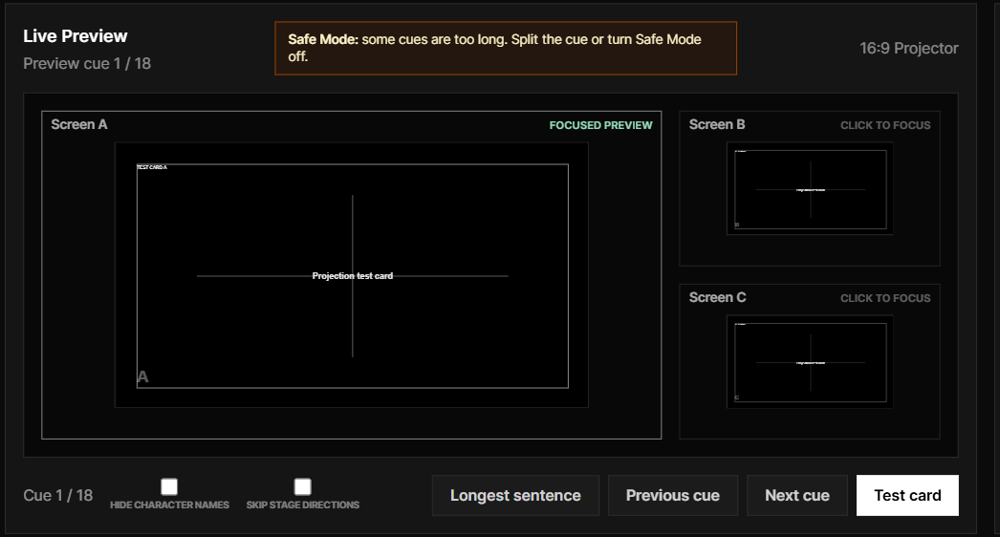
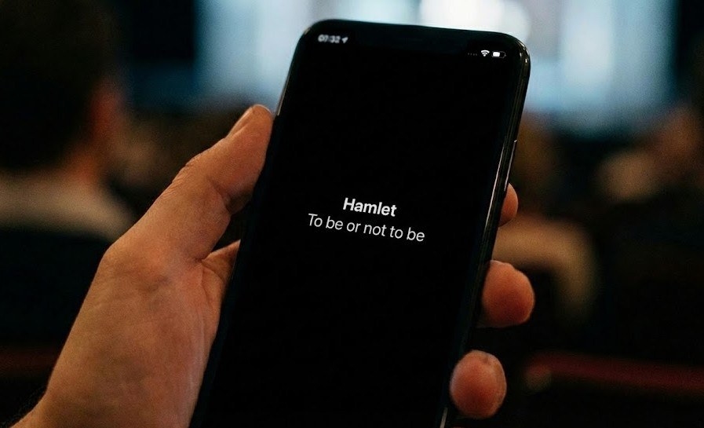

If your French, German, Spanish, or other non-English show is going to the Edinburgh Fringe, the question is usually not abstract.

It is practical:

**How will English-speaking audiences understand the show?**

You may already have a strong production. You may have a clear script, a finished translation, or a director who knows exactly how the rhythm should feel in English. But Fringe adds pressure. The venue may be unfamiliar. Technical time may be short. The audience may include local viewers, international programmers, reviewers, and people from the original-language community in the same room.

So the subtitle decision is not just "should we translate the play?"

It is:

- How do we add English surtitles without rebuilding the show around a screen?
- How do we preserve the original voice while giving audiences a readable English route into the work?
- How do we avoid a PowerPoint workflow that collapses when the performance changes?
- How do we choose a surtitles tool that a small touring team can actually run?

This guide is written for the person making that decision: the producer, artistic director, company manager, translator, or creative lead who needs English audiences to follow a non-English Fringe show.

## The short answer

To add English surtitles to a non-English Fringe show, first define what the audience needs. Then start from the script, prepare a reviewed English cue list, choose whether audiences will read the text on a shared screen, their own phones, or both, and rehearse a live operator who follows the actors.

Do not use “surtitles” and “captions” as if they promise the same service. The Fringe Society describes surtitles as English translation for work performed in another language; captions normally include dialogue plus relevant sound effects and off-stage sound. A translated surtitle track may improve access to language, but it does not automatically become a complete captioned performance.

For many Fringe teams, the lightest path is:

1. Upload the script.
2. Generate editable script lines/cues.
3. Review the English translation.
4. Test the display, audience entry route, network, and fallback with the venue.
5. Share a QR code or viewer link when mobile viewing is part of the plan.
6. Let a rehearsed operator cue the English surtitles during the live show.

That is the workflow SurtitleLive is built around.

See the SurtitleLive workflow in action:

<iframe width="560" height="315" src="https://www.youtube.com/embed/3v8jG9fVE3U?si=MSh11q_zA-8C1O1J" title="YouTube video player" frameborder="0" allow="accelerometer; autoplay; clipboard-write; encrypted-media; gyroscope; picture-in-picture; web-share" referrerpolicy="strict-origin-when-cross-origin" allowfullscreen style="max-width: 100%;"></iframe>

[Start your English surtitles workflow for Fringe](https://surtitlelive.com/auth/register)

## Step 1: Translate from the script, not from blank slides

The first mistake many companies make is starting with a slide deck.

It seems simple at first. Copy a line from the script. Paste it into PowerPoint. Split the text. Adjust the font. Repeat until the whole show has English surtitles.

Then the director cuts a line.

Then the translator changes a phrase.

Then rehearsal shows that one long sentence needs to become two shorter cues.

Now the slide deck is not just a delivery tool. It has become the subtitle database, the translation document, and the live playback system at the same time. That is fragile.

For a non-English Fringe show, the better starting point is the script.

Your surtitles should usually move through this path:

Script -> English translation -> editable lines/cues -> rehearsal review -> live cueing

SurtitleLive is built around a script-first workflow. A team can upload a Word (.docx) script, turn the extracted text into editable lines/cues, review and correct speakers, dialogue, and translation choices, then refine the English surtitles before performance.

The goal is not to remove human judgement. It is to spend less production time on manual copying and slide formatting, and more on language, timing, and rehearsal.

AI can help prepare a draft. The company still decides what the English audience should read.

This matters because surtitles are not just literal translation. They are performance writing. The English text has to be readable at the chosen display size, clear enough to follow, and timed closely enough to the actors that the audience can remain with the show.

## Step 2: Decide whether English and original-language audiences need different text

A non-English show at Fringe may have more than one audience need.

English-speaking audiences may need a clear translation.

Some audience members may understand the spoken language yet benefit from a written track. Others may read a prepared language more comfortably than English.

Some productions may also want additional non-English language choices. A French-language company might prepare English surtitles for Edinburgh audiences while also offering German or Dutch for partner venues in mainland Europe. A Turkish or Polish touring show might keep the original language visible while adding English and the language of a co-presenter. A co-production may need English for Fringe discovery while also supporting the languages of its touring partners.

International programmers may need to follow the story quickly without losing track of staging, music, or rhythm.

That is where a single projected subtitle line can become crowded.

For example:

- A Cantonese show may prepare English surtitles for local audiences and a written Cantonese track for people who choose it.
- A Spanish-language show may use English for programmers while retaining a reviewed Spanish viewer option.
- An Arabic-language show may offer English translation while making a prepared Arabic text track available to readers who prefer it.

If every language is placed on the same screen, the result can become less readable for everyone.

SurtitleLive lets the team prepare language options and let audience members choose the viewer language on their own device. An English-speaking audience member can follow the English surtitles. Another audience member can choose the original language or another prepared non-English language if the company provides it.

That is the value of mobile surtitles for some non-English Fringe work. It is not “phones instead of theatre,” and it is not automatically the right access design for every audience. It is a way to offer language choice without forcing every prepared track onto one shared projection surface.

## Translation access and accessibility are related, but not identical

English surtitles answer one important question: how can an audience follow a performance spoken in another language?

An accessible caption track may need to answer more:

- Who is speaking when the speaker is not visually clear?
- Which sound effects, music, or off-stage sounds carry meaning?
- Where can people read the text comfortably?
- Does the delivery method work for the intended users?
- Has the experience been tested with people who use captions?

This distinction should shape both the writing and the listing. If the production provides translated dialogue only, call it English surtitles. If it provides captions designed with D/deaf and hard-of-hearing audiences in mind, describe exactly what is included and how it will be delivered.

The honest description is more valuable than a broad accessibility label. It helps audiences decide whether the performance meets their needs, and it gives the production team a concrete standard to rehearse.

[See how to prepare English surtitles from your script](https://surtitlelive.com/features)

## Step 3: Choose the delivery method before you arrive at the venue

There are three common ways to deliver English surtitles at Fringe:

| Decision point | PowerPoint or slides | Fixed projected surtitles | SurtitleLive mobile surtitles |
| --- | --- | --- | --- |
| Multiple languages at once | Often crowded on one slide | May need multiple screens | Each audience member can choose a language |
| Actor skips a section | Operator searches through slides | Same linear pressure | Operator can jump to the right cue |
| Preparation starts from | Copy-paste into blank slides | Usually copy-paste or separate subtitle file | Word script to editable lines/cues |
| Fringe venue fit | Depends on screen setup | Depends on hardware and sightlines | Audience scans a QR code or opens a viewer link |
| Best fit | Very simple linear shows | Rooms with reliable projection | Touring teams needing flexible English surtitles |

This does not mean projection is wrong. If the room has a good screen, clear sightlines, and enough setup time, projected surtitles may be the best audience experience.

But many Fringe companies cannot assume that.

SurtitleLive supports both paths. The same operator workflow can cue surtitles to Projection Mode for a theatre screen while also serving mobile viewers for audiences who need a different language track. If the room can support projection, the company can use it. If some audience members need English, the original language, or another prepared language on their own device, the mobile viewer can run alongside it.

Mobile surtitles give you another route. Audience members scan a QR code or open a viewer link, choose an enabled language, and read the surtitles in their mobile browser. No app install is required.

For a non-English touring company, that reduces the dependency on venue hardware and gives the producer a clearer answer before arrival:

If projection works, use it.

If projection works but the audience needs more than one language, run projection and mobile viewing together.

If projection is risky, keep the audience-phone option ready.

If the audience needs different language tracks, do not force every track onto one screen.

Whichever path you choose, plan the whole audience journey. Confirm the venue's phone policy, signal or local network conditions, front-of-house briefing, QR placement, screen sightlines, seating implications, power, operator position, and a fallback if the primary display route fails. A QR code is an entry point, not an access plan by itself.

## Step 4: Keep the surtitles live with an operator

A scripted theatre performance is not a video file.

Actors breathe, pause, speed up, slow down, and sometimes skip.

That is why prepared English surtitles still need live cueing. The operator watches the show and advances the next cue at the right moment. If an actor jumps ahead, the operator needs a recovery path. If the wrong text is about to appear, the operator needs blackout.

This is where slide decks become stressful. They assume the show moves in a straight line.

SurtitleLive is designed around a live operator workflow. The operator follows the prepared cue list, advances the English surtitles in performance, and can recover when the show moves off the expected path.

For a decision-maker, the point is simple: the workflow should expect a live show to behave like a live show.

## Step 5: Check whether this workflow fits your Fringe show

SurtitleLive is a strong fit if your show has:

- a Word (.docx) script or libretto, or a mostly stable performance text
- a non-English source language
- English-speaking audiences, programmers, or reviewers
- a need for English surtitles at Fringe or on tour
- limited technical time in the venue
- a small team that cannot build a custom subtitle setup for every room
- possible multilingual audience needs
- enough rehearsal time to review the text and train an operator

It is not the right primary tool for every performance.

If the show is mostly improvised, changes heavily every night, or depends on long audience interaction, you may need a live captioner, speech-to-text reporter, or a hybrid workflow.

But if your show is scripted and you can prepare the English text before opening, a prepared surtitle workflow is often the clearer route.

[Start your Fringe surtitle workflow](https://surtitlelive.com/auth/register)

## A simple preparation timeline

If your Fringe show is already in rehearsal, use a practical schedule.

Three to four weeks before opening:

- confirm which language or languages you need
- prepare or commission the English translation
- upload the script and create the first cue draft
- review the English surtitles for clarity and length
- decide whether you are offering translated surtitles, accessibility captions, or both

One to two weeks before opening:

- rehearse with the cue list
- adjust line breaks and cue timing
- test the audience viewer link and QR code
- decide whether projection, mobile viewing, or both will be used
- confirm the plan with the venue and brief front of house
- test with the people the service is intended to support

During tech and performance:

- brief the operator
- test the QR code, network, sightlines, and fallback in the room
- run the first performance with live cueing
- revise the cue list after the show if needed

The work does not need to become a separate technical production. It needs to become part of your show workflow.

## FAQ

**Q: What is the basic workflow for adding English surtitles to a Fringe show?**

**A:** Prepare the English text from the current script, divide it into readable cues, review it with the creative team, choose projection, mobile viewing, or both, and rehearse a live operator against the performance.

**Q: Are English surtitles the same as accessibility captions?**

**A:** Not necessarily. English surtitles translate a performance spoken in another language. Captions commonly include relevant sound effects, music, and off-stage sound as well as dialogue. Describe the service according to what the audience will actually receive.

**Q: Should a Fringe show use projected or mobile surtitles?**

**A:** Choose according to the venue, audience, sightlines, language needs, phone policy, network conditions, and fallback plan. Projection can offer a shared focal point; mobile viewing can offer individual language choice. Some productions use both.

**Q: Do audience members need to install an app for SurtitleLive mobile surtitles?**

**A:** No. They open the audience viewer in a mobile browser through a QR code or link. The production should still test the entry route and brief front of house.

**Q: What if the Fringe show is improvised or changes every night?**

**A:** A prepared cue list may not be the right primary service. The Fringe Society recommends considering a speech-to-text reporter for unscripted, semi-improvised, or frequently changing work. A hybrid plan may also be appropriate.

## Sources and further guidance

- [Captioning your show, Edinburgh Festival Fringe](https://www.edfringe.com/take-part/artists/organise-a-show/make-your-show-accessible/captioning/)
- [How to start making your show accessible, Edinburgh Festival Fringe](https://www.edfringe.com/take-part/artists/organise-a-show/make-your-show-accessible/how-to-start-making-your-show-accessible/)
- [Marketing your accessible show, Edinburgh Festival Fringe](https://www.edfringe.com/take-part/artists/organise-a-show/make-your-show-accessible/marketing-your-accessible-show/)
